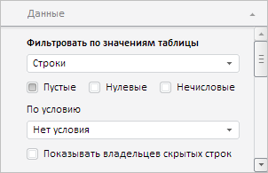

# EaxMdService.setFilter

EaxMdService.setFilter
-

**

# EaxMdService.setFilter

## Синтаксис

setFilter(report: PP.Exp.[EaxDocument](../EaxDocument/EaxDocument.htm), filterMetadata: Object, callback: PP.Delegate);

## Параметры

*report.* Документ экспресс-отчёта, данные которого нужно отфильтровать;

*filterMetadata.* Данные фильтра, представляющие собой JSON-объект со следующими полями: area - тип фильтрируемого объекта, conditionType - тип условия, elements - фильтририруемые элементы объекта, enabled - признак того, что фильтр активен, keepParent - признак того, что владельцы скрытых строк не будут отображены, range - диапазон фильтрации, suppressEmpty - признак запрета отображения пустых значений, suppressNoNumeric - признак запрета отображения нулевых значений, suppressZeros - признак запрета отображения нечисловых значений, useCondition - признак использования фильтрации по условию.

*callback.* Возвратная функция.

## Описание

Метод setFilter** устанавливает фильтр по значениям данных экспресс-отчета.

## Пример

Для выполнения примера необходимо наличие на html-странице компонента [ExpressBox](../../../Components/Express/ExpressBox/ExpressBox.htm) с наименованием «expressBox» (см. «[Пример создания компонента ExpressBox](../../../Components/Express/ExpressBox/ExpressBox_Example.htm)»). По умолчанию раздел «Фильтровать по значениям таблицы» на вкладке «Данные» боковой панели экспресс-отчета выглядит следующим образом:

Установим фильтр по строкам таблицы с запретом на отображение пустых значений:

// Получим сервис для работы с экспресс-отчетом
var eaxMdService = expressBox.getService();
// Получим документ экспресс-отчета
var eaxAnalyzer = expressBox.getSource();
// Определим метаданные для фильтра данных
var filterMetadata = {
    area: "Table",
    conditionType: "None",
    elements: "Rows",
    enabled: true,
    keepParent: false,
    suppressEmpty: true,
    suppressNoNumeric: false,
    suppressZeros: false,
    useCondition: true
};
// Определим аргументы для возвратной функции
var args = new PP.Mb.Ui.PropertyChangedEventArgs({
    PropertyName: PP.Exp.Ui.ControlType.Filter,
    Metadata: filterMetadata,
    TypeUpdateData: [PP.Exp.Ui.ViewTypeUpdate.DataView, PP.Exp.Ui.ViewTypeUpdate.Ribbon]
});
// Определим возвратную функцию
var onPanelChanged = function (n, t) {
    var chartView = expressBox.getDataView().getChartView();
    t ? (chartView.DataChanged.fire(chartView, t.Args), t.Args.fireCallback(n, t)) : chartView.DataChanged.fire(chartView, t);
};
// Установим фильтр по значениям данных таблицы экспресс-отчета
eaxMdService.setFilter(eaxAnalyzer, filterMetadata, PP.Delegate(onPanelChanged, eaxMdService, args));
// Обновим боковую панель
expressBox.getPropertyBarView().refreshAll();

В результате выполнения примера был установлен фильтр по строкам таблицы с запретом на отображение пустых значений:

См. также:

[EaxMdService](EaxMdService.htm)

		Справочная
		 система на версию 10.9
		 от 18/08/2025,
		 © ООО «ФОРСАЙТ»,
