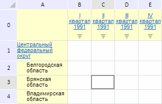

# EaxMdService.setGridDrillDown

EaxMdService.setGridDrillDown
-

**

# EaxMdService.setGridDrillDown

## Синтаксис

setGridDrillDown(report: PP.Exp.[EaxDocument](../EaxDocument/EaxDocument.htm),
 rowIndex: Number, colIndex: Number, callback: PP.Delegate, drillMethod:
 [PP.Mb.DrillMethod](dhtmlMetabase.chm::/Enums/DrillMethod.htm),
 dimKey: Number, range: PP.Ui.[TabSheetRange](dhtmlTabSheet.chm::/Classes/TabSheet/TabSheetRange/TabSheetRange.htm));

## Параметры

*report.* Документ экспресс-отчета;

*r**owIndex.* Индекс строки;

*colIndex.* Индекс столбца;

*callback.* Возвратная функция;

*drillMethod.* Метод перехода по иерархии отметок в таблице. В
 качестве значений параметра указываются элементы перечисления [PP.Mb.DrillMethod](dhtmlMetabase.chm::/Enums/DrillMethod.htm);

*dimKey.* Ключ измерения, по которому
 осуществляется переход. Необязательный параметр, по умолчанию его значение
 не определено;

*range.* Диапазон ячеек таблицы. Необязательный
 параметр, по умолчанию его значение не определено.

## Описание

Метод setGridDrillDown**
 осуществляет переход на уровень вниз или вверх по иерархии отметки в таблице.

## Пример

Для выполнения примера необходимо наличие на html-странице компонента
 [ExpressBox](../../../Components/Express/ExpressBox/ExpressBox.htm)
 с наименованием «expressBox» (см. «[Пример
 создания компонента ExpressBox](../../../Components/Express/ExpressBox/ExpressBox_Example.htm)») и с загруженной таблицей в рабочей
 области экспресс-отчёта. Календарное измерение в отчёте должно быть иерархическим.
 Перейдём на один уровень вверх по иерархии данного измерения:

// Получим сервис для работы с экспресс-отчетом
var eaxMdService = expressBox.getService();
// Получим документ экспресс-отчета
var eaxAnalyzer = expressBox.getSource();
// Определим метаданные
var rowIndex = 0;
var colIndex = 2;
var drillMethod = PP.Mb.DrillMethod.Down; // Переход отметки на уровень вниз
var dimKey = 106; // Измерение «Кадендарь»
// Определим возвратную функцию
var onSetGridDrillDown = function (sender, args) {
    expressBox.getDataView().getMapView().MetadataChanged.fire(this, args.Args);
    expressBox.refreshAll()
};
// Определим возвратную функцию
var callback = PP.Delegate(onSetGridDrillDown, eaxMdService);
// Перейдём на уровень вниз по иерархии отметки «Календарь»
eaxMbService.setGridDrillDown(eaxAnalyzer, rowIndex, colIndex, callback, drillMethod, dimKey);

В результате выполнения примера был выполнен переход на один уровень
 вверх по иерархии измерения «Календарь»:

См. также:

[EaxMdService](EaxMdService.htm)

		Справочная
		 система на версию 10.9
		 от 18/08/2025,
		 © ООО «ФОРСАЙТ»,
