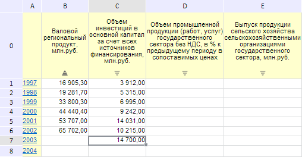

# EaxMdService.setGridSorting

EaxMdService.setGridSorting
-

**

# EaxMdService.setGridSorting

## Синтаксис

setGridSorting(report: PP.Exp.[EaxDocument](../EaxDocument/EaxDocument.htm),
 metadata: Object, callback: PP.Delegate);

## Параметры

*report.* Документ экспресс-отчёта;

*metadata.* Метаданные
 ячейки, сортировку которой необходимо изменить;

*callback.* Возвратная функция.

## Описание

Метод setGridSorting**
 эмулирует нажатие на значок сортировки в ячейке в таблице экспресс-отчета.

## Пример

Для выполнения примера необходимо наличие на html-странице компонента
 [ExpressBox](../../../Components/Express/ExpressBox/ExpressBox.htm)
 с наименованием «expressBox» (см. «[Пример
 создания компонента ExpressBox](../../../Components/Express/ExpressBox/ExpressBox_Example.htm)») и с загруженной таблицей в рабочей
 области экспресс-отчёта. Изменим сортировку первого столбца таблицы экспресс-отчета:

// Задаем координаты ячейки
var state = {
    rowIndex: 0,
    colIndex: 1
};
// Эмулируем нажатие на значок сортировки
eaxMdService.setGridSorting(eaxAnalyzer, state);
// Перерисовываем
expressBox.getDataView().refreshAll();

В результате выполнения примера был изменен тип сортировки первого столбца
 таблицы экспресс-отчета:

См. также:

[EaxMdService](EaxMdService.htm)

		Справочная
		 система на версию 10.9
		 от 18/08/2025,
		 © ООО «ФОРСАЙТ»,
