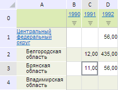

# EaxMdService.setMainTableStyle

EaxMdService.setMainTableStyle
-

**

# EaxMdService.setMainTableStyle

## Синтаксис

setMainTableStyle(report: PP.Exp.[EaxDocument](../EaxDocument/EaxDocument.htm), metadata: Object, callback: PP.Delegate);

## Параметры

*report.* Документ экспресс-отчета;

*metadata.* Настройки стиля таблицы в виде JSON-объекта со следующими полями: Name - наименование стиля, PredefinedStyle - предопределённый стиль, являющийся элементом перечисления PP.Exp.Ui.[TabTablePredefinedStyle](../../../Enums/TabTablePredefinedStyle.htm);

*callback.* Возвратная функция.

## Описание

Метод setMainTableStyle** устанавливает главный стиль для таблицы экспресс-отчёта.

## Пример

Для выполнения примера необходимо наличие на html-странице компонента [ExpressBox](../../../Components/Express/ExpressBox/ExpressBox.htm) с наименованием «expressBox» (см. «[Пример создания компонента ExpressBox](../../../Components/Express/ExpressBox/ExpressBox_Example.htm)») и с загруженной таблицей в рабочей области экспресс-отчёта. Применим к данной таблице новый стиль на основе уже предопределённого стиля:

// Получим сервис для работы с экспресс-отчетом
var eaxMdService = expressBox.getService();
// Получим документ экспресс-отчета
var eaxAnalyzer = expressBox.getSource();
// Определим метаданные
var metadata = {
    Name: "New table style",
    PredefinedStyle: PP.Exp.Ui.TabTablePredefinedStyle.ExtGreenStriped
};
// Определим аргументы для возвратной функции
var args = new PP.Mb.Ui.PropertyChangedEventArgs({
    PropertyName: PP.Exp.Ui.RibbonTableEnum.Style,
    Metadata: metadata,
    TypeUpdateData: [PP.Exp.Ui.ViewTypeUpdate.PropertyBar, PP.Exp.Ui.ViewTypeUpdate.Table]
});
// Определим возвратную функцию
var onPanelChanged = function (n, t) {
    var chartView = expressBox.getDataView().getChartView();
    t ? (chartView.DataChanged.fire(chartView, t.Args), t.Args.fireCallback(n, t)) : chartView.DataChanged.fire(chartView, t);
};
// Установим новый стиль таблицы
eaxMbService.setMainTableStyle(eaxAnalyzer, metadata, PP.Delegate(this.onPanelChanged, eaxMdService, args));
// Обновим экспресс-очет
expressBox.refreshAll();

В результате выполнения примера для таблицы экспресс-отчета был установлен новый стиль, созданный на базе предопределённого стиля PP.Exp.Ui.[TabTablePredefinedStyle](../../../Enums/TabTablePredefinedStyle.htm).ExtGreenStriped:

См. также:

[EaxMdService](EaxMdService.htm)

		Справочная
		 система на версию 10.9
		 от 18/08/2025,
		 © ООО «ФОРСАЙТ»,
