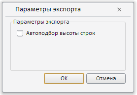

# EaxMdService.setMd

EaxMdService.setMd
-

**

# EaxMdService.setMd

## Синтаксис

setMd(sheet: PP.Exp.[EaxDocument](../EaxDocument/EaxDocument.htm));

## Параметры

*sheet.* Документ экспресс-отчёта.

## Описание

Метод setMd** устанавливает метаданные в объект экспресс-отчёта.

## Пример

Для выполнения примера необходимо наличие на html-странице компонента [HtmlExportDialog](../../../Components/Express/HtmlExportDialog/HtmlExportDialog.htm) с наименованием «htmlExpDialog» (см. «[Пример создания компонента HtmlExportDialog](../../../Components/Express/HtmlExportDialog/HtmlExportDialog_Example.htm)»):

Заменим содержимое функции showExpDialogOkClick, являющейся обработчиком события нажатия на кнопку OK, на следующий сценарий:

function showExpDialogOkClick(sender, args, callback) {
    // Определим экспортируемые данные
    var exportData = args.exportData || args || {};
    exportData.storeResult = true;
    exportData.palette = true;
    // Определим тело сообщения с экспортируемыми данными
    var body = {
        GetEaxMd: {
            tEax: eaxAnalyzer.getDocumentOdId ? eaxAnalyzer.getDocumentOdId() : eaxAnalyzer.getOdId(),
            tArg: {
                pattern: {
                    exportData: exportData
                }
            }
        }
    };
    // Установим метаданные в объект экспресс-отчета
    eaxMdService.setMd(eaxAnalyzer);
    // Определим возвратную функцию
    callback = eaxMdService._visitCallback(callback, new PP.Delegate(eaxMdService._onExportCompleted, eaxMdService, {
        Report: eaxAnalyzer
    }));
    // Отправим сервису сообщение с экспортируемыми данными экспресс-отчета
    eaxMdService._send(body, callback);
};

В результате выполнения примера после нажатия на кнопку OK будет показан диалог сохранения экспортируемого в HTML файла.

См. также:

[EaxMdService](EaxMdService.htm)

		Справочная
		 система на версию 10.9
		 от 18/08/2025,
		 © ООО «ФОРСАЙТ»,
