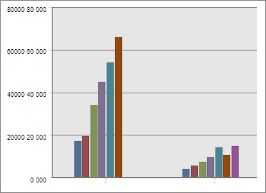
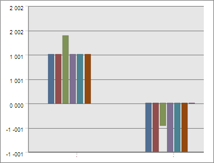

# EaxMdService.setNormalization

EaxMdService.setNormalization
-

**

# EaxMdService.setNormalization

## Синтаксис

setNormalization(report: PP.Exp.[EaxDocument](../EaxDocument/EaxDocument.htm), metadata: Object, callback: PP.Delegate);

## Параметры

*report.* Документ экспресс-отчета;

*metadata.* JSON-объект с полем useNormalization, являющимся признаком использования нормализации данных;

*callback.* Функция обратного вызова.

## Описание

Метод setNormalization** нормализует данные диаграммы экспресс-отчёта.

## Пример

Для выполнения примера необходимо наличие на html-странице компонента [ExpressBox](../../../Components/Express/ExpressBox/ExpressBox.htm) с наименованием «expressBox» (см. «[Пример создания компонента ExpressBox](../../../Components/Express/ExpressBox/ExpressBox_Example.htm)»). Перейдём в представление «Диаграмма» экспресс-отчета. Первоначально данные диаграммы не нормализованы, фрагмент её приведен на следующем рисунке:

Нормализуем данные диаграммы экспресс-отчета:

// Получим сервис для работы с экспресс-отчетом
var eaxMdService = expressBox.getService();
// Получим документ экспресс-отчета
var eaxDocument = expressBox.getSource();
// Определим метаданные
var metadata = {
    useNormalization: true
};
// Определим функцию обратного вызова
var onNormalization = function (sender, args) {
    var chart = expressBox.getDataView().getChartView();
    chart.PropertyChanged.fire(sender, new PP.Mb.Ui.PropertyChangedEventArgs({
        PropertyName: PP.Exp.Ui.ControlType.Text,
        Metadata: {
            useNormalization: true
        },
        TypeUpdateData: [PP.Exp.Ui.ViewTypeUpdate.Chart, PP.Exp.Ui.ViewTypeUpdate.Table]
    }));
    // Обновляем диаграмму
    chart.refreshAll();
};
// Нормализуем данные диаграммы экспресс-отчета
eaxMdService.setNormalization(eaxDocument, metadata, PP.Delegate(onNormalization, this));

В результате выполнения примера данные диаграммы экспресс-отчета будут нормализованы:

См. также:

[EaxMdService](EaxMdService.htm)

		Справочная
		 система на версию 10.9
		 от 18/08/2025,
		 © ООО «ФОРСАЙТ»,
