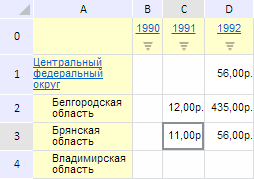

# EaxMdService.setNumberFormat

EaxMdService.setNumberFormat
-

**

# EaxMdService.setNumberFormat

## Синтаксис

setNumberFormat(report: PP.Exp.[EaxDocument](../EaxDocument/EaxDocument.htm),
 metadata: Object, callback: PP.Delegate);

## Параметры

*report.* Документ экспресс-отчета;

*metadata.* JSON-объект с полем «@FT», определяющим индекс формата
 данных таблицы. Значение данного поля задаётся с помощью перечисления
 PP.Exp.Ui.[RibbonTableNFormatEnum](../../../Enums/RibbonTableNFormatEnum.htm);

*callback.* Функция обратного
 вызова.

## Описание

Метод setNumberFormat**
 устанавливает формат данных в таблице экспресс-отчета.

## Пример

Для выполнения примера необходимо наличие на html-странице компонента
 [ExpressBox](../../../Components/Express/ExpressBox/ExpressBox.htm)
 с наименованием «expressBox» (см. «[Пример
 создания компонента ExpressBox](../../../Components/Express/ExpressBox/ExpressBox_Example.htm)») и с загруженной таблицей в рабочей
 области экспресс-отчёта. Откроем таблицу и установим для её данных денежный
 формат:

// Получим сервис для работы с экспресс-отчетом
var eaxMdService = expressBox.getService();
// Получим документ экспресс-отчета
var eaxAnalyzer = expressBox.getSource();
// Определим метаданные
var metadata = {};
metadata["@FT"] = PP.Exp.Ui.RibbonTableNFormatEnum.Money; // Установим денежный формат
// Определим аргументы для возвратной функции
var args = new PP.Mb.Ui.PropertyChangedEventArgs({
    PropertyName: PP.Exp.Ui.RibbonTableEnum.TableNumber,
    Metadata: metadata,
    TypeUpdateData: [PP.Exp.Ui.ViewTypeUpdate.Table, PP.Exp.Ui.ViewTypeUpdate.Ribbon]
});
// Определим возвратную функцию
var onPanelChanged = function (n, t) {
    var chartView = expressBox.getDataView().getChartView();
    t ? (chartView.DataChanged.fire(chartView, t.Args), t.Args.fireCallback(n, t)) : chartView.DataChanged.fire(chartView, t);
};
// Изменим формат отображения чисел
eaxMbService.setNumberFormat(eaxAnalyzer, metadata, PP.Delegate(this.onPanelChanged, eaxMdService, args));
// Обновим экспресс-отчет
expressBox.refreshAll();

В результате выполнения примера для данных таблицы экспресс-отчета был
 применён денежный формат:

См. также:

[EaxMdService](EaxMdService.htm)

		Справочная
		 система на версию 10.9
		 от 18/08/2025,
		 © ООО «ФОРСАЙТ»,
