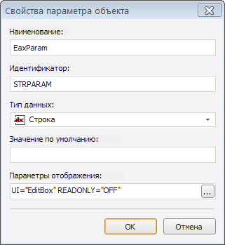
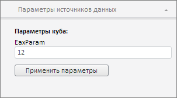

# EaxMdService.setParams

EaxMdService.setParams
-

# EaxMdService.setParams

## Синтаксис

setParams(analyzer: PP.Exp.[EaxAnalyzer](../EaxAnalyzer/EaxAnalyzer.htm),
 paramsMeta, callback: PP.Delegate);

## Параметры

*analyzer.* Экспресс-отчет, для параметров
 которого требуется установить настройки;

*paramsMeta.* Настройки параметров
 источника данных экспресс-отчета;

*callback.* Возвратная
 функция.

## Описание

Метод setParams устанавливает
 метаданные параметров источника данных экспресс-отчета.

## Пример

Для выполнения примера необходимо наличие на html-странице компонента
 [ExpressBox](../../../Components/Express/ExpressBox/ExpressBox.htm)
 с наименованием «expressBox» (см. «[Пример
 создания компонента ExpressBox](../../../Components/Express/ExpressBox/ExpressBox_Example.htm)»). Для источника данных (куба) экспресс-отчета
 должен быть установлен параметр с настройками, указанными на следующем
 рисунке:

Изменим значение данного параметра:

// Получим сервис для работы с экспресс-отчетом
var eaxMdService = expressBox.getService();
// Получим документ экспресс-отчета
var eaxDocument = expressBox.getSource();
// Получаем панель «Параметры источников данных»
var paramsPanel = expressBox.getPropertyBarView().getDataSourceParamsPanel();
var paramsMeta = [{
    dt: 1,
    id: "STRPARAM",
    k: 1,
    n: "EaxParam",
    value: "12",
    vis: true
}];
// Определим аргументы возвратной функции
var onSetDataSourceParamsArgs = new PP.Mb.Ui.PropertyChangedEventArgs({
    PropertyName: PP.Exp.Ui.ControlType.DataSourceParams,
    Metadata: {
        params: paramsMeta
    },
    TypeUpdateData: [PP.Exp.Ui.ViewTypeUpdate.DataView, PP.Exp.Ui.ViewTypeUpdate.Ribbon, PP.Exp.Ui.ViewTypeUpdate.DimBar]
});
// Определим возвратную функцию
var onSetDataSourceParams = function (sender, args) {
    expressBox.getPropertyBarView().PropertyChanged.fire(this, args.Args);
}
// Отправляем настройки параметра сервису
eaxMdService.setParams(eaxDocument, paramsMeta, PP.Delegate(onSetDataSourceParams, this, onSetDataSourceParamsArgs));

После выполнения примера сохраните экспресс-отчет и обновите его средствами
 браузера. В результате параметр «EaxParam» будет иметь значение 12:

См. также:

[EaxMdService](EaxMdService.htm)

		Справочная
		 система на версию 10.9
		 от 18/08/2025,
		 © ООО «ФОРСАЙТ»,
