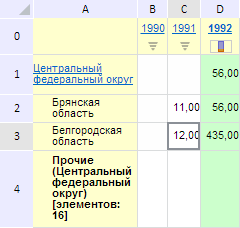

# EaxMdService.setPareto

EaxMdService.setPareto
-

**

# EaxMdService.setPareto

## Синтаксис

setPareto(report: PP.Exp.[EaxDocument](../EaxDocument/EaxDocument.htm),
 metadata: Object, callback: PP.Delegate);

## Параметры

*report.* Документ экспресс-отчета;

*metadata.* Настройки распределения
 по Парето, представленные в виде JSON-объекта со вложенными свойствами
 columnsSettings и rowsSettings. Каждый их этих свойств может иметь следующие
 поля: displayMax - признак отображения максимума, elementIndex - индекс
 элемента, enabled - признак доступности данного элемента, kind - вид распределения
 по Парето (значение задаётся с помощью перечисления PP.Exp.Ui.[PvtParetoKind](../../../Enums/PvtParetoKind.htm)),
 threshold - значение для указанного вида распределение;

*callback.* Функция обратного
 вызова.

## Описание

Метод setPareto** устанавливает
 распределение по Парето в экспресс-отчете.

## Пример

Для выполнения примера необходимо наличие на html-странице компонента
 [ExpressBox](../../../Components/Express/ExpressBox/ExpressBox.htm)
 с наименованием «expressBox» (см. «[Пример
 создания компонента ExpressBox](../../../Components/Express/ExpressBox/ExpressBox_Example.htm)») и с загруженной таблицей в рабочей
 области экспресс-отчёта. Распределим данные в столбце таблицы с индексом
 2 по принципу «Первые 20%»:

// Получим сервис для работы с экспресс-отчетом
var eaxMdService = expressBox.getService();
// Получим документ экспресс-отчета
var eaxAnalyzer = expressBox.getSource();
// Определим настройки строк и столбцов
var metadata = {
    pivot: {
        pareto: {
            columnsSettings: {
                displayMax: false,
                elementIndex: "2", // Индекс элемента
                enabled: true,
                kind: "Percent", // Распределение «Первые 20%»
                threshold: "0.2"
            },
            rowsSettings: {
                enabled: false
            }
        }
    }
};
// Определим аргументы для возвратной функции
var args = new PP.Mb.Ui.PropertyChangedEventArgs({
    PropertyName: PP.Exp.Ui.RibbonTableEnum.TablePareto,
    Metadata: metadata,
    TypeUpdateData: PP.Exp.Ui.ViewTypeUpdate.DataView
});
// Определим возвратную функцию
var onPanelChanged = function (n, t) {
    var chartView = expressBox.getDataView().getChartView();
    t ? (chartView.DataChanged.fire(chartView, t.Args), t.Args.fireCallback(n, t)) : chartView.DataChanged.fire(chartView, t);
};
// Установим новый тип распределения элементов
eaxMbService.setPareto(eaxAnalyzer, metadata, PP.Delegate(this.onPanelChanged, eaxMdService, args));
// Обновим экспресс-отчет
expressBox.refreshAll();

В результате выполнения примера данные в столбце таблицы с индексом
 2 были распределены по принципу «Первые 20%»:

См. также:

[EaxMdService](EaxMdService.htm)

		Справочная
		 система на версию 10.9
		 от 18/08/2025,
		 © ООО «ФОРСАЙТ»,
