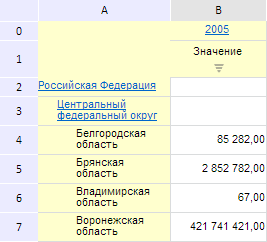
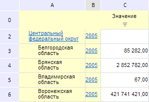

# EaxMdService.setPivotDims

EaxMdService.setPivotDims
-

**

# EaxMdService.setPivotDims

## Синтаксис

setPivotDims(report: PP.Exp.[EaxDocument](../EaxDocument/EaxDocument.htm), ownerDimsMetadata: Object, callback: PP.Delegate);

## Параметры

*report.* Документ экспресс-отчёта;

*ownerDimsMetadata.* Метаданные, содержащие информацию об измерениях и их положении;

*callback.* Функция обратного вызова на получение метаданных отчета.

## Описание

Метод setPivotDims** устанавливает новое положение измерений в таблице экспресс-отчета.

## Пример

Для выполнения примера необходимо наличие на html-странице компонента [ExpressBox](../../../Components/Express/ExpressBox/ExpressBox.htm) с наименованием «expressBox» (см. «[Пример создания компонента ExpressBox](../../../Components/Express/ExpressBox/ExpressBox_Example.htm)») и с загруженной таблицей в рабочей области экспресс-отчета. В источнике данных должны быть измерения с ключами 98, 103, 104, 105 и 106. Нужно, чтобы одно из них располагалось по столбцам, например, измерение «Календарь» с ключом 106 (на рисунке изображен элемент «2005»):

Изменим положение измерения «Календарь» по строкам таблицы:

// Получим сервис для работы с экспресс-отчетом
var eaxMdService = expressBox.getService();
// Получим боковую панель
var dimBar = expressBox.getPropertyBarView().getDimBarViewPanel();
// Покажем панель
dimBar.show();
// Раскроем панель
dimBar.expand(true);
// Определим метаданные
var metadata = {
    dims: {
        its: {
            it: [{
                "k": 105, // Измерение «Территориальные преобразования»
                "position": "Left"
            }, {
                "k": 106, // Измерение «Календарь»
                "position": "Left"
            }, {
                "k": 98, // Измерение «Факты»
                "position": "Top"
            }, {
                "k": 103,
                "position": "Fixed"
            }, {
                "k": 104,
                "position": "Fixed"
            }]
        }
    }
};
var metadataForService = new PP.Mb.Ui.PropertyChangedEventArgs({
    PropertyName: PP.Exp.Ui.ControlType.DimOrder,
    Metadata: metadata,
    TypeUpdateData: [PP.Exp.Ui.ViewTypeUpdate.DataView, PP.Exp.Ui.ViewTypeUpdate.Ribbon,
        PP.Exp.Ui.ViewTypeUpdate.PropertyBar]
});
// Определим функцию обратного вызова
var onPivotDimsConfirm = function (sender, args) {
    expressBox.getDataView().getMapView().MetadataChanged.fire(this, args.Args);
    expressBox.refreshAll()
};
// Установим новый формат
eaxMdService.setPivotDims(expressBox.getSource(), metadata,
    PP.Delegate(onPivotDimsConfirm, this, metadataForService));

В результате выполнения примера измерение «Календарь» стало располагаться по строкам таблицы:

См. также:

[EaxMdService](EaxMdService.htm)

		Справочная
		 система на версию 10.9
		 от 18/08/2025,
		 © ООО «ФОРСАЙТ»,
