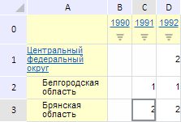

# EaxMdService.setRanking

EaxMdService.setRanking
-

**

# EaxMdService.setRanking

## Синтаксис

setRanking(report: PP.Exp.[EaxDocument](../EaxDocument/EaxDocument.htm),
 rankingMetadata: Object, callback: PP.Delegate);

## Параметры

*report.* Документ экспресс-отчёта;

*rankingMetadata.* Настройки ранжирования
 данных. Параметр представляет собой JSON-объект со следующими свойствами:
 «@rankAreaType» - тип области, по которой проводится ранжирование (значение
 задаётся с помощью перечисления PP.Exp.Ui.[RankingEnum](../../../Enums/RankingEnum.htm)),
 «@rankAreaType» - тип ранжирования, задаваемый с помощью перечисления
 PP.Exp.Ui.[RankTypeEnum](../../../Enums/RankTypeEnum.htm);

*callback.* Возвратная функция.

## Описание

Метод setRanking выполняет
 ранжирование данных в экспресс-отчете.**

## Пример

Для выполнения примера необходимо наличие на html-странице компонента
 [ExpressBox](../../../Components/Express/ExpressBox/ExpressBox.htm)
 с наименованием «expressBox» (см. «[Пример
 создания компонента ExpressBox](../../../Components/Express/ExpressBox/ExpressBox_Example.htm)») и с загруженной таблицей в рабочей
 области экспресс-отчёта. Выполним ранжирование данных в таблице по убыванию
 по столбцам:

// Получим сервис для работы с экспресс-отчетом
var eaxMdService = expressBox.getService();
// Получим документ экспресс-отчета
var eaxAnalyzer = expressBox.getSource();
// Определим настройки ранжирования данных
var rankingMetadata = {};
rankingMetadata["@rankAreaType"] = PP.Exp.Ui.RankingEnum.Column; // Ранжирование по столбцам
rankingMetadata["@rankType"] = PP.Exp.Ui.RankTypeEnum.Desc; // Ранжирование по убыванию
// Определим аргументы для возвратной функции
var args = new PP.Mb.Ui.PropertyChangedEventArgs({
    PropertyName: PP.Exp.Ui.ControlType.Ranking,
    Metadata: rankingMetadata,
    TypeUpdateData: [PP.Exp.Ui.ViewTypeUpdate.DataView, PP.Exp.Ui.ViewTypeUpdate.PropertyBar]
});
// Определим возвратную функцию
var onPanelChanged = function (n, t) {
    var chartView = expressBox.getDataView().getChartView();
    t ? (chartView.DataChanged.fire(chartView, t.Args), t.Args.fireCallback(n, t)) : chartView.DataChanged.fire(chartView, t);
};
// Отобразим данные таблицы как ранги
eaxMbService.setRanking(eaxAnalyzer, rankingMetadata, PP.Delegate(this.onPanelChanged, eaxMdService, args));
// Обновим экспресс-отчет
expressBox.refreshAll();

В результате выполнения примера данные таблицы были отображены как ранги
 по убыванию по столбцам:

См. также:

[EaxMdService](EaxMdService.htm)

		Справочная
		 система на версию 10.9
		 от 18/08/2025,
		 © ООО «ФОРСАЙТ»,
