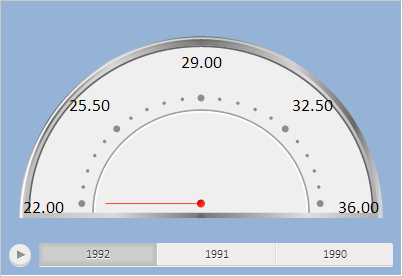

# EaxMdService.setSpeedometer

EaxMdService.setSpeedometer
-

# EaxMdService.setSpeedometer

## Синтаксис

setSpeedometer(report: [PP.Exp.EaxAnalyzer](../EaxAnalyzer/EaxAnalyzer.htm),
 metadata: Object, callback: function|PP.Delegate);

## Параметры

report. Объект модели экспресс-отчёта;

metadata. Настройки спидометра;

callback. Возвратная функция.

## Описание

Метод setSpeedometer устанавливает
 спидометр для аналитической панели.

## Пример

Для выполнения примера требуется наличие на html-странице компонента
 [KapBox](dhtmlAdhoc.chm::/Components/KapBox/KapBox.htm)
 с наименованием «kapBox» (см. «[Пример
 размещения компонента KapBox](dhtmlAdhoc.chm::/Components/KapBox/KapBox_example.htm)»). Затем необходимо добавить на аналитическую
 панель спидометр, используя кнопку «Визуализаторы» и её элемент «Индикатор»
 на ленте инструментов.

Установим для заливки фона спидометра светло-голубой цвет:

// Получаем контейнер добавленного спидометра
var props = kapBox.getMeta().Md.kap.block.prop;
// Получаем ключ блока, содержащего контейнер со спидометром
var key;
for (var i in props) {
    if (props[i].area) {
        key = kapBox.getMeta().Md.kap.block.prop[i].area["@key"];
    }
};
var block = kapBox.getBlock(key);
var dataBox = block.getDataBox();
// Получаем сервис контейнера и его источник данных
var service = dataBox.getService();
var source = dataBox.getSource();
// Получаем настройки спидометра
var data = dataBox.getInstance().getSettings(PP.SpeedometerSettings.All, true, false,
    false, true);
// Определяем для заливки фона спидометра новый цвет
var style = {
        Release: {
            Background: {
                "@Enabled": true,
                "@Color": PP.Color.Colors.lightblue
            }
        }
    }
    // Применяем стиль
data.Style = style;
// Устанавливаем данные с изменёнными настройками контейнера
source.setGaugeChangedData(data);
source.setGaugeData(data);
// Применяем новые настройки
service.setSpeedometer(source, source.getGaugeData());
// Обновляем контейнер
dataBox.refreshAll();
В результате выполнения примера для заливки фона спидометра был установлен
 светло-голубой цвет:

[EaxMdService](EaxMdService.htm)

		Справочная
		 система на версию 10.9
		 от 18/08/2025,
		 © ООО «ФОРСАЙТ»,
