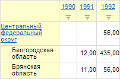

# EaxMdService.setTabSheetHeaders

EaxMdService.setTabSheetHeaders
-

**

# EaxMdService.setTabSheetHeaders

## Синтаксис

setTabSheetHeaders(report: PP.Exp.[EaxDocument](../EaxDocument/EaxDocument.htm), metadata: Boolean, callback: PP.Delegate);

## Параметры

*report.* Документ экспресс-отчёта;

*metadata.* Признак видимости заголовков таблицы. Если параметр равен значению true, то они будут отображены, иначе - не будут;

*callback.* Возвратная функция.

## Описание

Метод setTabSheetHeaders** управляет отображением заголовков таблицы экспресс-отчета.

## Пример

Для выполнения примера необходимо наличие на html-странице компонента [ExpressBox](../../../Components/Express/ExpressBox/ExpressBox.htm) с наименованием «expressBox» (см. «[Пример создания компонента ExpressBox](../../../Components/Express/ExpressBox/ExpressBox_Example.htm)») и с загруженной таблицей в рабочей области экспресс-отчёта. Скроем заголовки данной таблицы:

// Получим сервис для работы с экспресс-отчетом
var eaxMdService = expressBox.getService();
// Получим документ экспресс-отчета
var eaxAnalyzer = expressBox.getSource();
// Определим метаданные
var metadata = false; // Скроем заголовки таблицы экспресс-отчёта
// Определим аргументы для возвратной функции
var args = new PP.Mb.Ui.PropertyChangedEventArgs({
    PropertyName: PP.Exp.Ui.ControlType.Headers,
    Metadata: metadata,
    TypeUpdateData: [PP.Exp.Ui.ViewTypeUpdate.Table, PP.Exp.Ui.ViewTypeUpdate.PropertyBar]
});
// Определим возвратную функцию
var onPanelChanged = function (n, t) {
    var chartView = expressBox.getDataView().getChartView();
    t ? (chartView.DataChanged.fire(chartView, t.Args), t.Args.fireCallback(n, t)) : chartView.DataChanged.fire(chartView, t);
};
// Установим значение видимости заголовков таблицы
eaxMbService.setTabSheetHeaders(eaxAnalyzer, metadata, PP.Delegate(this.onPanelChanged, eaxMdService, args));
// Обновим экспресс-отчет
expressBox.refreshAll();

В результате выполнения примера были скрыты заголовки таблицы экспресс-отчета:

См. также:

[EaxMdService](EaxMdService.htm)

		Справочная
		 система на версию 10.9
		 от 18/08/2025,
		 © ООО «ФОРСАЙТ»,
