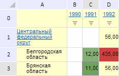

# EaxMdService.setTableCFormat

EaxMdService.setTableCFormat
-

**

# EaxMdService.setTableCFormat

## Синтаксис

setTableCFormat(report: PP.Exp.[EaxDocument](../EaxDocument/EaxDocument.htm), metadata: Object, callback: PP.Delegate);

## Параметры

*report.* Документ экспресс-отчёта;

*metadata.* Настройки форматирования таблицы;

*callback.* Возвратная функция.

## Описание

Метод setTableCFormat** устанавливает условное форматирование таблицы экспресс-отчета.

## Пример

Для выполнения примера необходимо наличие на html-странице компонента [ExpressBox](../../../Components/Express/ExpressBox/ExpressBox.htm) с наименованием «expressBox» (см. «[Пример создания компонента ExpressBox](../../../Components/Express/ExpressBox/ExpressBox_Example.htm)») и с загруженной таблицей в рабочей области экспресс-отчёта. Изменим форматирование таблицы, используя раскраску ячеек путём масштабирования их значений с цветами от зелёного до красного:

// Получим сервис для работы с экспресс-отчетом
var eaxMdService = expressBox.getService();
// Получим документ экспресс-отчета
var eaxAnalyzer = expressBox.getSource();
// Определим метаданные
var metadata = {
    Metadata: {
        PredefinedScale: PP.Exp.Ui.TabTablePredefinedScale.GreenRed, // Задаём зелёный и красный цвет
        Type: "Scale" // Раскраска ячеек путём масштабирования их значений
    }
};
// Определим аргументы для возвратной функции
var args = new PP.Mb.Ui.PropertyChangedEventArgs({
    PropertyName: PP.Exp.Ui.RibbonTableEnum.CFormat,
    Metadata: metadata,
    TypeUpdateData: [PP.Exp.Ui.ViewTypeUpdate.PropertyBar, PP.Exp.Ui.ViewTypeUpdate.Table]
});
// Определим возвратную функцию
var onPanelChanged = function (n, t) {
    var chartView = expressBox.getDataView().getChartView();
    t ? (chartView.DataChanged.fire(chartView, t.Args), t.Args.fireCallback(n, t)) : chartView.DataChanged.fire(chartView, t);
};
// Установим новое форматирование таблицы
eaxMbService.setTableCFormat(eaxAnalyzer, metadata, PP.Delegate(this.onPanelChanged, eaxMdService, args));
// Обновим экспресс-отчет
expressBox.refreshAll();

В результате выполнения примера было изменено форматирование таблицы экспресс-отчета с использованием раскраски ячеек путём масштабирования их значений с цветами от зелёного до красного:

См. также:

[EaxMdService](EaxMdService.htm)

		Справочная
		 система на версию 10.9
		 от 18/08/2025,
		 © ООО «ФОРСАЙТ»,
