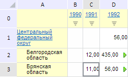

# EaxMdService.setTableGrowth

EaxMdService.setTableGrowth
-

**

# EaxMdService.setTableGrowth

## Синтаксис

setTableGrowth(report: PP.Exp.[EaxDocument](../EaxDocument/EaxDocument.htm),
 inRow: Boolean|null, callback: PP.Delegate);

## Параметры

*report.* Документ экспресс-отчёта;

*inRow.* Тип индикатора роста. Значение
 параметра задаётся с помощью перечисления PP.Exp.Ui.[IndicatorType](../../../Enums/IndicatorType.htm);

*callback.* Возвратная функция.

## Описание

Метод setTableGrowth**
 устанавливает индикатор роста в таблице экспресс-отчёта.

## Пример

Для выполнения примера необходимо наличие на html-странице компонента
 [ExpressBox](../../../Components/Express/ExpressBox/ExpressBox.htm)
 с наименованием «expressBox» (см. «[Пример
 создания компонента ExpressBox](../../../Components/Express/ExpressBox/ExpressBox_Example.htm)») и с загруженной таблицей в рабочей
 области экспресс-отчёта. Установим индикатор роста для строк таблицы:

// Получим сервис для работы с экспресс-отчетом
var eaxMdService = expressBox.getService();
// Получим документ экспресс-отчета
var eaxAnalyzer = expressBox.getSource();
// Определим индикатор роста для строк
var inRow = false;
// Определим метаданные для возвратной функции
var metadata = inRow ? PP.Exp.Ui.IndicatorType.Rows : PP.Exp.Ui.IndicatorType.Columns;
// Определим аргументы для возвратной функции
var args = new PP.Mb.Ui.PropertyChangedEventArgs({
    PropertyName: PP.Exp.Ui.ControlType.Indicator,
    Metadata: metadata,
    TypeUpdateData: [PP.Exp.Ui.ViewTypeUpdate.Table, PP.Exp.Ui.ViewTypeUpdate.PropertyBar]
});
// Определим возвратную функцию
var onPanelChanged = function (n, t) {
    var chartView = expressBox.getDataView().getChartView();
    t ? (chartView.DataChanged.fire(chartView, t.Args), t.Args.fireCallback(n, t)) : chartView.DataChanged.fire(chartView, t);
};
// Установим индикатор роста в таблице
eaxMbService.setTableGrowth(eaxAnalyzer, inRow, PP.Delegate(this.onPanelChanged, eaxMdService, args));
// Обновим экспресс-отчет
expressBox.refreshAll();

В результате выполнения примера был установлен индикатор роста для строк
 таблицы экспресс-отчёта:

См. также:

[EaxMdService](EaxMdService.htm)

		Справочная
		 система на версию 10.9
		 от 18/08/2025,
		 © ООО «ФОРСАЙТ»,
