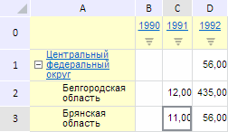

# EaxMdService.setTables

EaxMdService.setTables
-

**

# EaxMdService.setTables

## Синтаксис

setTables(report: PP.Exp.[EaxDocument](../EaxDocument/EaxDocument.htm),
 metadata: Object, callback: PP.Delegate);

## Параметры

*report.* Документ экспресс-отчёта;

*metadata.* Настройки таблицы экспресс-отчета.
 Параметр представляет собой JSON-объект, который может содержать вложенный
 объект grid с полями columnsHierarchica и rowsHierarchical (признаки отображения
 иерархий по шапке и боковику таблицы соответственно) и объект pivot с
 полем «@sortDiapason» (диапазон сортировки в таблице, задаваемый с помощью
 перечисления PP.Exp.Ui.[PvtSortDiapason](../../../Enums/PvtSortDiapason.htm));

*callback.* Возвратная функция.

## Описание

Метод setTables** устанавливает
 настройки сортировки и отображения иерархий для таблицы экспресс-отчета.

## Пример

Для выполнения примера необходимо наличие на html-странице компонента
 [ExpressBox](../../../Components/Express/ExpressBox/ExpressBox.htm)
 с наименованием «expressBox» (см. «[Пример
 создания компонента ExpressBox](../../../Components/Express/ExpressBox/ExpressBox_Example.htm)») и с загруженной таблицей в рабочей
 области экспресс-отчёта. Измерение по строкам должно быть иерархическим.
 Отобразим столбец-заголовок таблицы в виде иерархии:

// Получим сервис для работы с экспресс-отчетом
var eaxMdService = expressBox.getService();
// Получим документ экспресс-отчета
var eaxAnalyzer = expressBox.getSource();
// Определим настройки таблицы экспресс-отчета
var metadata = {
    grid: {
        columnsHierarchical: true, // Отобразим столбец-заголовок таблицы в виде иерархии
    }
}
// Определим аргументы для возвратной функции
var args = new PP.Mb.Ui.PropertyChangedEventArgs({
    PropertyName: PP.Exp.Ui.ControlType.TableSortingMethod,
    Metadata: metadata,
    TypeUpdateData: [PP.Exp.Ui.ViewTypeUpdate.Table, PP.Exp.Ui.ViewTypeUpdate.Ribbon]
});
// Определим возвратную функцию
var onPanelChanged = function (n, t) {
    var chartView = expressBox.getDataView().getChartView();
    t ? (chartView.DataChanged.fire(chartView, t.Args), t.Args.fireCallback(n, t)) : chartView.DataChanged.fire(chartView, t);
};
// Установим новые значения свойств таблиц
eaxMdService.setTables(eaxAnalyzer, metadata, PP.Delegate(this.onPanelChanged, eaxMdService, args));
// Обновим экспресс-отчет
expressBox.refreshAll();

В результате выполнения примера столбец-заголовок таблицы был отображён
 в виде иерархии, о чём свидетельствует наличие кнопки развёртывания:

См. также:

[EaxMdService](EaxMdService.htm)

		Справочная
		 система на версию 10.9
		 от 18/08/2025,
		 © ООО «ФОРСАЙТ»,
