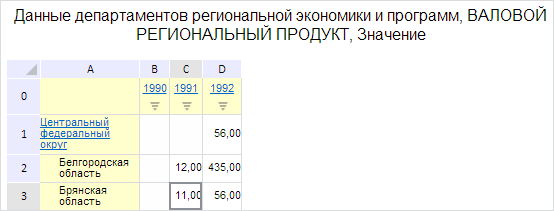

# EaxMdService.setTitle

EaxMdService.setTitle
-

**

# EaxMdService.setTitle

## Синтаксис

setTitle(report: PP.Exp.[EaxDocument](../EaxDocument/EaxDocument.htm), metadata: Object, callback: PP.Delegate);

## Параметры

*report.* Документ экспресс-отчёта;

*metadata.* Объект с настройками заголовка. Представляет собой JSON-объект со следующими свойствами: isControl - признак отображения заголовка в виде простого текста, а не элемента управления, visible - признак его видимости в отчёте;

*callback.* Возвратная функция.

## Описание

Метод setTitle** позволяет отобразить заголовок экспресс-отчета.

## Пример

Для выполнения примера необходимо наличие на html-странице компонента [ExpressBox](../../../Components/Express/ExpressBox/ExpressBox.htm) с наименованием «expressBox» (см. «[Пример создания компонента ExpressBox](../../../Components/Express/ExpressBox/ExpressBox_Example.htm)»). Отобразим заголовок экспресс-отчета в виде простого текста:

// Получим сервис для работы с экспресс-отчетом
var eaxMdService = expressBox.getService();
// Получим документ экспресс-отчета
var eaxAnalyzer = expressBox.getSource();
// Определим настройки заголовка
var metadata = {
    isControl: false, // Используем простой заголовок (не элемент управления)
    visible: true // Отобразим заголовок в экспресс-отчете
};
// Определим аргументы для возвратной функции
var args = new PP.Mb.Ui.PropertyChangedEventArgs({
    PropertyName: PP.Exp.Ui.TitleProperties.Visible,
    Metadata: metadata,
    TypeUpdateData: PP.Exp.Ui.ViewTypeUpdate.Title
});
// Определим возвратную функцию
var onPanelChanged = function (n, t) {
    var chartView = expressBox.getDataView().getChartView();
    t ? (chartView.DataChanged.fire(chartView, t.Args), t.Args.fireCallback(n, t)) : chartView.DataChanged.fire(chartView, t);
    // Обновим заголовок экспресс-отчёта
    var title = expressBox.getDataView().getTitleView();
    title.refreshAll();
};
// Установим заголовок в виде простого текста
eaxMbService.setTitle(eaxAnalyzer, metadata, PP.Delegate(this.onPanelChanged, eaxMdService, args));

В результате выполнения примера заголовок экспресс-отчёта был отображён в виде простого текста:

См. также:

[EaxMdService](EaxMdService.htm)

		Справочная
		 система на версию 10.9
		 от 18/08/2025,
		 © ООО «ФОРСАЙТ»,
