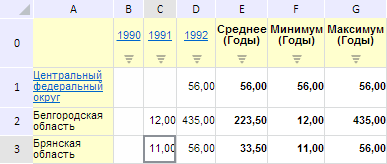

# EaxMdService.setTotals

EaxMdService.setTotals
-

**

# EaxMdService.setTotals

## Синтаксис

setTotals(report: PP.Exp.[EaxDocument](../EaxDocument/EaxDocument.htm),
 metadata: Object, callback: PP.Delegate);

## Параметры

*report.* Документ экспресс-отчёта;

*metadata.* Настройки отображения итоговых
 данных в таблице. Параметр представляет собой JSON-объект, который может
 содержать вложенные объекты columnTypes и rowTypes с полем t (массив агрегатных
 функций, представляемых элементами перечисления PP.Exp.Ui.[TotalsEnum](../../../Enums/TotalsEnum.htm));

*callback.* Возвратная
 функция.

## Описание

Метод setTotals** устанавливает
 настройки для отображения итоговых данных в таблице экспресс-отчёта.

## Пример

Для выполнения примера необходимо наличие на html-странице компонента
 [ExpressBox](../../../Components/Express/ExpressBox/ExpressBox.htm)
 с наименованием «expressBox» (см. «[Пример
 создания компонента ExpressBox](../../../Components/Express/ExpressBox/ExpressBox_Example.htm)») и с загруженной таблицей в рабочей
 области экспресс-отчёта. Отобразим в таблице итоги по столбцам:

// Получим сервис для работы с экспресс-отчетом
var eaxMdService = expressBox.getService();
// Получим документ экспресс-отчета
var eaxAnalyzer = expressBox.getSource();
// Определим метаданные
var metadata = {
    columnTypes: {
        // Отобразим среднее, максимальное и минимальное значение по столбцам
        t: [PP.Exp.Ui.TotalsEnum.Avg, PP.Exp.Ui.TotalsEnum.Min, PP.Exp.Ui.TotalsEnum.Max]
    },
    rowTypes: {
        t: PP.Exp.Ui.TotalsEnum.None
    }
};
// Определим аргументы для возвратной функции
var args = new PP.Mb.Ui.PropertyChangedEventArgs({
    PropertyName: PP.Exp.Ui.ControlType.Totals,
    Metadata: metadata,
    TypeUpdateData: [PP.Exp.Ui.ViewTypeUpdate.DataView, PP.Exp.Ui.ViewTypeUpdate.PropertyBar, PP.Exp.Ui.ViewTypeUpdate.Ribbon]
});
// Определим возвратную функцию
var onPanelChanged = function (n, t) {
    var chartView = expressBox.getDataView().getChartView();
    t ? (chartView.DataChanged.fire(chartView, t.Args), t.Args.fireCallback(n, t)) : chartView.DataChanged.fire(chartView, t);
};
// Отобразим итоги
eaxMbService.setTotals(eaxAnalyzer, metadata, PP.Delegate(this.onPanelChanged, eaxMdService, args));
// Обновим экспресс-отчет
expressBox.refreshAll();

В результате выполнения примера в таблице были отображены итоги по столбцам:

См. также:

[EaxMdService](EaxMdService.htm)

		Справочная
		 система на версию 10.9
		 от 18/08/2025,
		 © ООО «ФОРСАЙТ»,
