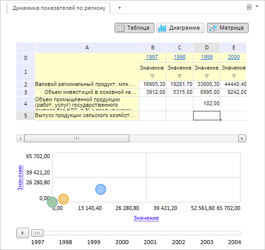

# EaxMdService.setWindowsPosition

EaxMdService.setWindowsPosition
-

**

# EaxMdService.setWindowsPosition

## Синтаксис

setWindowsPosition(report: PP.Exp.[EaxDocument](../EaxDocument/EaxDocument.htm), metadata: Object, callback: PP.Delegate);

## Параметры

*report.* Экземпляр экспресс-отчета;

*metadata.* Раскладка представлений экспресс-отчета. Параметр представляет собой JSON-объект со свойством windowsPosition, определяющим взаимное расположение представлений экспресс-отчёта;

*callback.* Возвратная функция.

## Описание

Метод setWindowsPosition** устанавливает раскладку представлений экспресс-отчета.

## Пример

Для выполнения примера необходимо наличие на html-странице компонента [ExpressBox](../../../Components/Express/ExpressBox/ExpressBox.htm) с наименованием «expressBox» (см. «[Пример создания компонента ExpressBox](../../../Components/Express/ExpressBox/ExpressBox_Example.htm)»). Установим вертикальную раскладку представлений экспресс-отчета:

// Получим сервис для работы с экспресс-отчетом
var eaxMdService = expressBox.getService();
// Получим документ экспресс-отчета
var eaxAnalyzer = expressBox.getSource();
// Определяем возвратную функцию
var onSetWindowsPositionChanged = function (sender, args) {
    var eaxToolBar = expressBox.getDataView().getToolBarView();
    eaxToolBar.setEnabled(true);
    expressBox.refreshAll();
};
// Определяем метаданные
var metadata = {
    windowsPosition: "Vertical"
};
// Устанавливаем раскладку
eaxMdService.setWindowsPosition(eaxAnalyzer, metadata, PP.Delegate(onSetWindowsPositionChanged, this));

После выполнения данного примера помимо раскладки «Таблица» выберем также раскладку «пузырьковая диаграмма». Они будут располагаться вертикально:

См. также:

[EaxMdService](EaxMdService.htm)

		Справочная
		 система на версию 10.9
		 от 18/08/2025,
		 © ООО «ФОРСАЙТ»,
