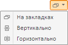

# EaxModeSelectorView.ModeSelectorState

EaxModeSelectorView.ModeSelectorState
-

**

# EaxModeSelectorView.ModeSelectorState

## Синтаксис

ModeSelectorState: PP.Exp.Ui.[EaxModeSelector](../../../Enums/EaxModeSelectorType.htm)

## Описание

Свойство ModeSelectorState** устанавливает и возвращает выбранный режим отображения представлений данных.

## Комментарии

Значение свойства ModeSelectorState задается при помощи метода setModeSelectorState и возвращается при помощи метода getModeSelectorState. Из JSON значение свойства задать нельзя.

При вызове метода getModeSelectorState указывается параметр sender, являющийся элементом перечисления PP.Exp.Ui.[EaxModeSelectorType](../../../Enums/EaxModeSelectorType.htm).

Метод setModeSelectorState возвращает JSON-объект со свойством windowsPosition, обозначающим расположение окон в рабочей области экспресс-отчета.

Кнопка, предназначенная для выбора режима отображения представлений данных, выглядит следующим образом:

## Пример

Пример использования приведен на странице описания метода [EaxDataView.getModeSelectorView](../EaxDataView/EaxDataView.getModeSelectorView.htm).

См. также:

[EaxModeSelectorView](EaxModeSelectorView.htm)

		Справочная
		 система на версию 10.9
		 от 18/08/2025,
		 © ООО «ФОРСАЙТ»,
