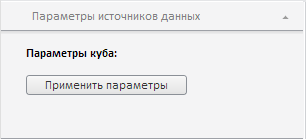

# EaxParameterView.ParamChanged

EaxParameterView.ParamChanged
-

**

# EaxParameterView.ParamChanged

## Синтаксис

ParamChanged: function (sender, args);

## Параметры

sender. Источник события;

args. Информация о событии. Доступные аргументы: NewValue - новое значение, присваиваемое параметру, Visible - признак видимости параметра.

## Описание

Событие ParamChanged** наступает при изменении параметра экспресс-отчета.

## Пример

Для выполнения примера необходимо наличие на html-странице компонента [ExpressBox](../ExpressBox/ExpressBox.htm) с наименованием «expressBox» (см. [Пример создания компонента ExpressBox](../../../Components/Express/ExpressBox/ExpressBox_Example.htm)). Обработаем событие ParamChanged, выводя в консоль браузера новое значение параметра и признак его видимости, а затем проверим выполняемость созданного обработчика:

// Получаем объект класса EaxParameterView
var paramsPanel = expressBox.getPropertyBarView().getDataSourceParamsPanel()
// Получаем представление параметра
var parameterView = paramsPanel._Items[0];
// Обрабатываем событие ParamChanged
parameterView.ParamChanged.add(
    function (sender, args) {
        var message;
        if (args.NewValue != undefined)
                console.log("NewValue: " + args.NewValue);
        if (args.Visible != undefined)
                console.log("Is visible: " + args.Visible);
    }
);
// Меняем значение параметра
parameterView.setParamValue(12);
// Скроем параметр
parameterView.setParamVisible(false);

В результате выполнения примера в консоли браузера будут выведены данные об изменившихся свойствах параметра:

NewValue: 12

Is visible: false

А сам параметр будет скрыт:

См. также:

[EaxParameterView](EaxParameterView.htm)

		Справочная
		 система на версию 10.9
		 от 18/08/2025,
		 © ООО «ФОРСАЙТ»,
