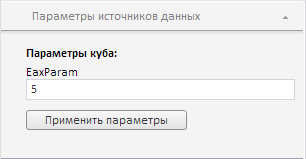

# EaxParameterView.applyParameter

EaxParameterView.applyParameter
-

**

# EaxParameterView.applyParameter

## Синтаксис

applyParameter();

## Описание

Метод applyParameter** сохраняет значение и настройку видимости, установленные для параметра экспресс-отчета.

## Комментарии

Использование данного метода актуально только в том случае, если для источника данных экспресс-отчёта настроены параметры.

## Пример

Для выполнения примера необходимо наличие на html-странице компонента [ExpressBox](../ExpressBox/ExpressBox.htm) с наименованием «expressBox» (см. [Пример создания компонента ExpressBox](../../../Components/Express/ExpressBox/ExpressBox_Example.htm)). Первый параметр источника данных экспресс-отчета должен быть числового типа. Отобразим данный параметр, зададим для него новое значение и сохраним сделанные изменения:

// Получаем объект класса EaxParameterView
var paramsPanel = expressBox.getPropertyBarView()
    .getDataSourceParamsPanel();
// Получаем представление параметра
var parameterView = paramsPanel._Items[0];
// Получаем текстовое поле для редактирования значения параметра
var parameterInstance = parameterView._Instance;
// Устанавливаем новое значение
parameterInstance.setValue(5);
// Делаем текстовое поле видимым
parameterInstance.setIsVisible(true);
// Применяем новые настройки
parameterView.applyParameter();

В результате выполнения примера был отображён первый параметр источника данных, задано новое значение 5, после чего все изменения были сохранены:

См. также:

[EaxParameterView](EaxParameterView.htm)

		Справочная
		 система на версию 10.9
		 от 18/08/2025,
		 © ООО «ФОРСАЙТ»,
