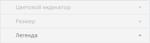

# EaxPropertyBar.getBubbleChartMaster

EaxPropertyBar.getBubbleChartMaster
-

**

# EaxPropertyBar.getBubbleChartMaster

## Синтаксис

getBubbleChartMaster(bubbleChartView);

## Параметры

*bubbleChartView. Необязательный
 параметр: является представлением мастера объекта «[Пузырьковая
 диаграмма](UiVisualizators.chm::/BubbleChart/BubbleChart.htm)» у экспресс-отчета.*

## Описание

Метод getBubbleChartMaster**
 возвращает мастер объекта экспресс-отчета «[Пузырьковая
 диаграмма](UiVisualizators.chm::/BubbleChart/BubbleChart.htm)».

## Комментарии

Группа вкладок мастера объекта экспресс-отчета «[Пузырьковая
 диаграмма](UiVisualizators.chm::/BubbleChart/BubbleChart.htm)» для работы с отметкой, возвращаемого данным
 методом, выглядит следующим образом:

## Пример

Пример использования приведен на странице описания метода [EaxBubbleChartView.addBubbleSettings](../EaxBubbleChartView/EaxBubbleChartView.addBubbleSettings.htm).

См. также:

[EaxPropertyBar](EaxPropertyBar.htm)

		Справочная
		 система на версию 10.9
		 от 18/08/2025,
		 © ООО «ФОРСАЙТ»,
