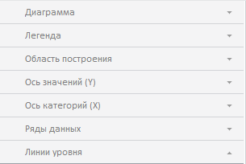

# EaxPropertyBar.getChartMaster

EaxPropertyBar.getChartMaster
-

**

# EaxPropertyBar.getChartMaster

## Синтаксис

getChartMaster(chartView);

## Параметры

*chartView. Необязательный параметр. Является представлением диаграммы.*

## Описание

Метод getChartMaster** возвращает мастер диаграммы.

## Комментарии

Группа вкладок мастера диаграммы, возвращаемого данным методом, выглядит следующим образом:

## Пример

Пример использования метода приведен на странице описания метода [EaxPropertyBar.getAnalysisPanel()](EaxPropertyBar.getAnalysisPanel.htm).

См. также:

[EaxPropertyBar](EaxPropertyBar.htm)

		Справочная
		 система на версию 10.9
		 от 18/08/2025,
		 © ООО «ФОРСАЙТ»,
