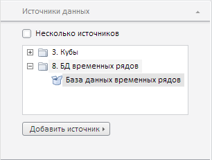

# EaxPropertyBar.getDataSourcesPanel

EaxPropertyBar.getDataSourcesPanel
-

**

# EaxPropertyBar.getDataSourcesPanel

## Синтаксис

getDataSourcesPanel();

## Описание

Метод getDataSourcesPanel** возвращает панель «Источники данных».

## Комментарии

Панель «Источники данных», возвращаемая данным методом, может выглядеть следующим образом:

## Пример

Пример использования метода приведен на странице описания свойства [DataSourcesPanel.OpenMode](../DataSourcesPanel/DataSourcesPanel.OpenMode.htm).

См. также:

[EaxPropertyBar](EaxPropertyBar.htm)

		Справочная
		 система на версию 10.9
		 от 18/08/2025,
		 © ООО «ФОРСАЙТ»,
