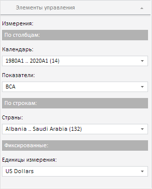

# EaxPropertyBar.getDimBarViewPanel

EaxPropertyBar.getDimBarViewPanel
-

**

# EaxPropertyBar.getDimBarViewPanel

## Синтаксис

getDimBarViewPanel();

## Описание

Метод getDimBarViewPanel** возвращает панель «Элементы управления».

## Комментарии

Панель «Элементы управления», возвращаемая данным методом, выглядит следующим образом:

## Пример

Пример использования приведен на странице описания метода [EaxDimBarView.getCurrentState](../EaxDimBarView/EaxDimBarView.getCurrentState.htm).

См. также:

[EaxPropertyBar](EaxPropertyBar.htm)

		Справочная
		 система на версию 10.9
		 от 18/08/2025,
		 © ООО «ФОРСАЙТ»,
