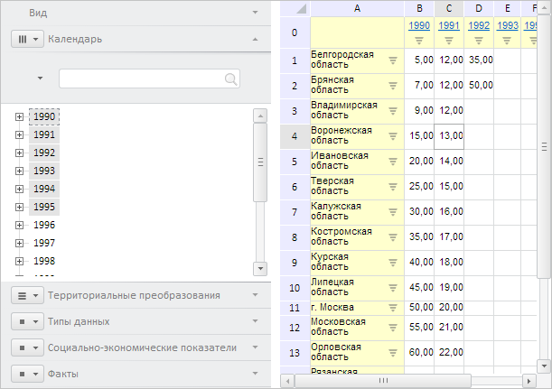

# EaxPropertyBar.refreshDimHighlighting

EaxPropertyBar.refreshDimHighlighting
-

# EaxPropertyBar.refreshDimHighlighting

## Синтаксис

refreshDimHighlighting();

## Описание

Метод refreshDimHighlighting обновляет подсветку элементов измерений.

## Пример

Для выполнения примера необходимо наличие на html-странице компонента [EaxPropertyBar](../../../Components/Express/EaxPropertyBar/EaxPropertyBar.htm) с наименованием «eaxPropBar» (см. «[Пример совместного размещения EaxPropertyBar и EaxGrid](../../../Components/Express/EaxGrid/EaxGrid_Example.htm)»). Отобразим на панели свойств мастер для управления отметкой в измерениях, раскроем его первую вкладку и обновим подсветку элементов измерений. Также определим наименования всех доступных измерений в экспресс-отчёте:

// Получим мастер для управления отметкой в измерениях
var master = eaxPropBar.getDimBarMasterView();
// Отобразим мастер
master.show();
// Раскроем первую вкладку мастера
master.getItems()[0].expand();
// Обновим подсветку элементов измерений
eaxPropBar.refreshDimHighlighting();
// Получим настройки панели свойств
var options = eaxPropBar.getOptions();
// Получим наименования доступных измерений
var names = [];
for (var i in options.dims.its.it) {
    names[i] = options.dims.its.it[i].n;
};
console.log("Доступные измерения: %s", names.toString());

В результате выполнения примера на панели свойств был отображён мастер для управления отметкой в измерениях, раскрыта его первая вкладка и обновлена подсветка элементов измерений:

В консоли браузера были выведены наименования всех доступных измерений в экспресс-отчёте:

Доступные измерения: Территориальные преобразования,Календарь,Типы данных,Социально-экономические показатели,Факты

См. также:

[EaxPropertyBar](EaxPropertyBar.htm)

		Справочная
		 система на версию 10.9
		 от 18/08/2025,
		 © ООО «ФОРСАЙТ»,
