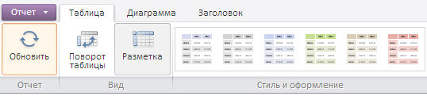

# EaxRibbonView.getChartCategory

EaxRibbonView.getChartCategory
-

**

# EaxRibbonView.getChartCategory

## Синтаксис

getChartCategory();

## Описание

Метод getChartCategory** возвращает представление вкладки «Диаграмма» на ленте инструментов экспресс-отчета.

## Пример

Для выполнения примера необходимо наличие на html-странице компонента [ExpressBox](../ExpressBox/ExpressBox.htm) с наименованием «expressBox» (см. [Пример создания компонента ExpressBox](../../../Components/Express/ExpressBox/ExpressBox_Example.htm)). Скроем вкладки «Главная», «Данные», «Вид» и покажем следующие вкладки: «Таблица», «Диаграмма», «Заголовок» на ленте инструментов:

// Получим объект ленты инструментов экспресс-отчета
var ribbon = expressBox.getRibbonView();
// Покаж);ем вкладку «Диаграмма»
ribbon.getChartCategory().show();
// Покажем вкладку «Таблица»
ribbon.getTableCategory().show();
// Покажем вкладку «Заголовок»
ribbon.getTitleCategory().show();
// Скроем вкладку «Главная»
ribbon.getMainCategory().hide();
// Скроем вкладку «Данные»
ribbon.getDataRibbonCategory().hide();
// Скроем вкладку «Вид»
ribbon.getViewRibbonCategory().hide();

До применения метода вкладки выглядят следующим образом:

После использования метода вкладки выглядят следующим образом:

См. также:

[EaxRibbonView](EaxRibbonView.htm)

		Справочная
		 система на версию 10.9
		 от 18/08/2025,
		 © ООО «ФОРСАЙТ»,
