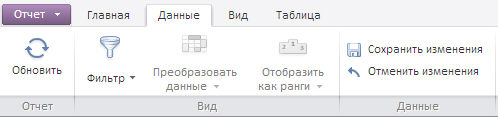
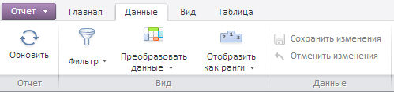

# EaxRibbonView.setPropertyValue

EaxRibbonView.setPropertyValue
-

**

# EaxRibbonView.setPropertyValue

## Синтаксис

setPropertyValue(propertyName: PP.Exp.Ui.[EaxPropertyViews](../../../Enums/EaxPropertyViews.htm), value: Object);

## Параметры

*p*ropertyName. Наименование свойства;

*value.* Присваиваемое значение.

## Описание

Метод setPropertyValue** устанавливает значение свойства для ленты инструментов экспресс-отчёта.

## Пример

Для выполнения примера необходимо наличие на html-странице компонента [ExpressBox](../ExpressBox/ExpressBox.htm) с наименованием «expressBox» (см. [Пример создания компонента ExpressBox](../../../Components/Express/ExpressBox/ExpressBox_Example.htm)). Сделаем недоступными кнопки «Сохранить изменения» и «Отменить изменения» и включить кнопки «Преобразовать данные» и «Отобразить как ранги» на ленте инструментов экспресс-отчета:

// Получим представление ленты инструментов экспресс-отчета
var ribbon = expressBox.getRibbonView();
// Установим значение для свойства GridChangeData
ribbon.setPropertyValue(PP.Exp.Ui.EaxPropertyViews.GridChangeData, true);

До выполнения примера лента инструментов выглядела следующим образом:

В результате выполнения примера стали недоступными кнопки «Сохранить изменения» и «Отменить изменения», а также были включены кнопки «Преобразовать данные» и «Отобразить как ранги» на ленте инструментов экспресс-отчета:

См. также:

[EaxRibbonView](EaxRibbonView.htm)

		Справочная
		 система на версию 10.9
		 от 18/08/2025,
		 © ООО «ФОРСАЙТ»,
