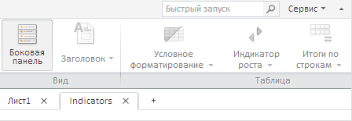

# ExpressBox.getService

ExpressBox.getService
-

**

# ExpressBox.getService

## Синтаксис

getService();

## Описание

Метод getService** возвращает сервис для работы с экспресс-отчетами.

## Пример

Для выполнения примера необходимо наличие на html-странице компонента ExpressBox с наименованием «expressBox» (см. «[Пример создания компонента ExpressBox](../../../Components/Express/ExpressBox/ExpressBox_Example.htm)»). Добавим новый лист с названием «Indicators» в созданный экспресс-отчёт:

// Получаем сервис для работы с экспресс-отчётами
var service = expressBox.getService();
// Получаем данные
var doc = expressBox.getSource();
// Задаем обработчик события добавления нового листа
onSheetAdded = function (sender, args) {
    expressBox.getDataView().DocDataChanged.fire(this, new PP.Mb.Ui.PropertyChangedEventArgs({
        PropertyName: PP.Exp.Ui.ControlType.DataView,
        Metadata: null,
        TypeUpdateData: [PP.Exp.Ui.ViewTypeUpdate.Ribbon, PP.Exp.Ui.ViewTypeUpdate.PropertyBar,
            PP.Exp.Ui.ViewTypeUpdate.Title]
    }));
};
// Добавляем новый лист в документ
service.addSheet(doc, "Indicators", true, PP.Delegate(onSheetAdded , doc));

// Затем обновим экспресс-отчет
expressBox.refreshAll();

После выполнения примера в документ будет добавлен новый лист «Indicators»:

См. также:

[ExpressBox](ExpressBox.htm)

		Справочная
		 система на версию 10.9
		 от 18/08/2025,
		 © ООО «ФОРСАЙТ»,
