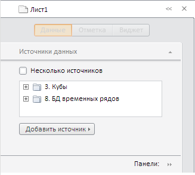

# ExpressView.resetTitle

ExpressView.resetTitle
-

**

# ExpressView.resetTitle

## Синтаксис

resetTitle();

## Описание

Метод resetTitle** сбрасывает заголовок на панели Header, входящей в состав боковой панели экспресс-отчета.

## Комментарий

После выполнения метода заголовок имеет наименование по умолчанию.

## Пример

Для выполнения примера необходимо наличие на html-странице компонента [ExpressBox](../ExpressBox/ExpressBox.htm) с наименованием «expressBox» (см. [Пример создания компонента ExpressBox](../../../Components/Express/ExpressBox/ExpressBox_Example.htm)), а также должны быть выполнены методы [ExpressView.setTitle()](ExpressView.setTitle.htm) и ExpressView.refreshAll() . Далее сбросим установленный заголовок:

// Сброс заголовка
expressBox.resetTitle();
// Обновляем все элементы экспресс-отчета, включая заголовок
expressBox.refreshAll();

После выполнения данного примера заголовок примет стандартное наименование «Лист 1».

См. также:

[ExpressView](ExpressView.htm)

		Справочная
		 система на версию 10.9
		 от 18/08/2025,
		 © ООО «ФОРСАЙТ»,
