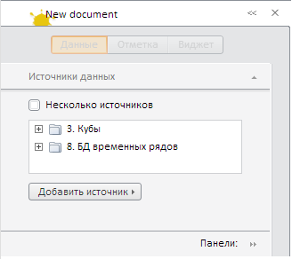

# ExpressView.setTitle

ExpressView.setTitle
-

**

# ExpressView.setTitle

## Синтаксис

setTitle(name, columnIndex, rowIndex);

## Параметры

*name. Наименование заголовка;*

*columnIndex. И*ндекс столбца с пиктограммой;

*rowIndex. И*ндекс строки с пиктограммой.

## Описание

Метод setTitle** устанавливает заголовок на панели Header, входящей в состав боковой панели экспресс-отчета.

## Пример

Для выполнения примера необходимо наличие на html-странице компонента [ExpressBox](../ExpressBox/ExpressBox.htm) с наименованием «expressBox» (см. [Пример создания компонента ExpressBox](../../../Components/Express/ExpressBox/ExpressBox_Example.htm)). Далее установим новый заголовок на панели Header, входящей в состав боковой панели экспресс-отчета:

// Установка нового заголовка с пиктограммой
expressBox.setTitle("New document", 1, 1);
// Обновляем все элементы экспресс-отчета, включая заголовок
expressBox.refreshAll();

После выполнения данного примера заголовок будет иметь наименование «New document» и заданную пиктограмму:

См. также:

[ExpressView](ExpressView.htm)

		Справочная
		 система на версию 10.9
		 от 18/08/2025,
		 © ООО «ФОРСАЙТ»,
