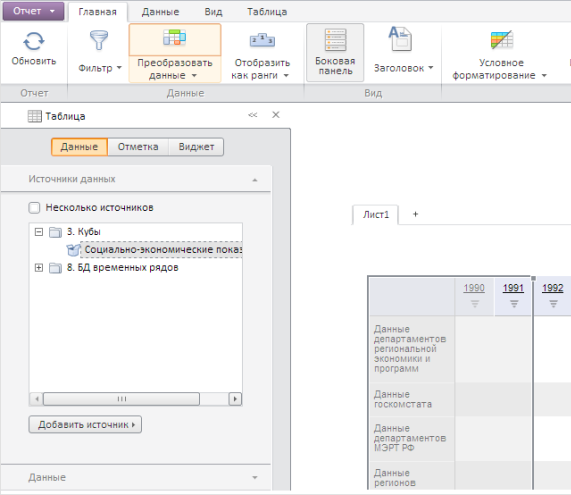

# ExpressView.getDataView

ExpressView.getDataView
-

# ExpressView.getDataView

## Синтаксис

getDataView();

## Описание

Метод getDataView возвращает
 представление области данных экспресс-отчета.

## Пример

Для выполнения примера необходимо наличие на html-странице компонента
 [ExpressBox](../ExpressBox/ExpressBox.htm) с наименованием
 «expressBox» (см. [Пример
 создания компонента ExpressBox](../../../Components/Express/ExpressBox/ExpressBox_Example.htm)). Получим представление области данных
 экспресс-отчёта и разрешим её перемещать мышью:

// Получаем представление области данных экспресс-отчёта
var dataView = expressBox.getDataView();
// Разрешаем перемещение области данных экспресс-отчёта
dataView.setDraggable(true);

В результате выполнения данного примера область данных экспресс-отчёта
 переместится в заданную пользователем позицию:

См. также:

[ExpressView](ExpressView.htm)

		Справочная
		 система на версию 10.9
		 от 18/08/2025,
		 © ООО «ФОРСАЙТ»,
