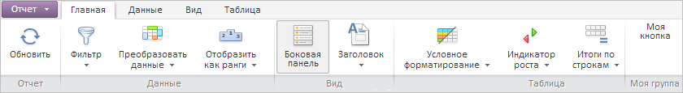

# ExpressView.getRibbonView

ExpressView.getRibbonView
-

# ExpressView.getRibbonView

## Синтаксис

getRibbonView();

## Описание

Метод getRibbonView возвращает представление ленты инструментов экспресс-отчета.

## Пример

Для выполнения примера необходимо наличие на html-странице компонента [ExpressBox](../ExpressBox/ExpressBox.htm) с наименованием «expressBox» (см. [Пример создания компонента ExpressBox](../../../Components/Express/ExpressBox/ExpressBox_Example.htm)). Получим представление панели инструментов экспресс-отчета и добавим на вкладку ленты инструментов новую группу кнопок, в которой разместим одну кнопку:

// Получаем представление ленты инструментов экспресс-отчета
var ribbonView = expressBox.getRibbonView();
// Добавляем собственную кнопку в новую группу кнопок на панели инструментов
ribbonView.getControl().getCategory(0).addPanel(
new PP.Ui.RibbonPanel({
    Elements: [new PP.Ui.RibbonButton({
        Content: "Моя кнопка"
    })],
    Caption: "Моя группа"
}));

После выполнения примера на ленту инструментов экспресс-отчета будет добавлена новая группа кнопок «Моя группа» с одноимённой кнопкой:

См. также:

[ExpressView](ExpressView.htm)

		Справочная
		 система на версию 10.9
		 от 18/08/2025,
		 © ООО «ФОРСАЙТ»,
