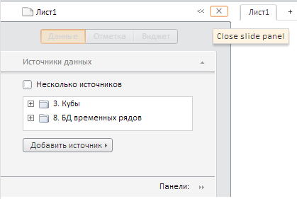

# ExpressView.getSlidePanelView

ExpressView.getSlidePanelView
-

# ExpressView.getSlidePanelView

## Синтаксис

getSlidePanelView(): [PP.Ui.SlidePanel](dhtmlUi.chm::/Classes/SlidePanel/slidepanel.htm);

## Описание

Метод getSlidePanelView возвращает
 представление элемента управления, состоящего из трех связанных панелей
 - Header, Details
 и View.

## Комментарий

Возвращаемый элемент управления используется в качестве контейнера для
 панели свойств экспресс-отчета.

## Пример

Для выполнения примера необходимо наличие на html-странице компонента
 [ExpressBox](../ExpressBox/ExpressBox.htm) с наименованием
 «expressBox» (см. [Пример
 создания компонента ExpressBox](../../../Components/Express/ExpressBox/ExpressBox_Example.htm)). Получим представление рассматриваемого
 элемента управления и установим текст всплывающей подсказки для кнопки
 закрытия, расположенной на панели Header:

// Получаем представление боковой панели
var slidePanel = expressBox.getSlidePanelView();
// Устанавливаем всплывающую подсказку для кнопки закрытия
slidePanel.setCloseToolTip("Close slide panel");

После выполнения примера всплывающая подсказка для кнопки закрытия,
 расположенной на панели Header,
 будет иметь текст «CloseSlidePanel»:

См. также:

[ExpressView](ExpressView.htm)

		Справочная
		 система на версию 10.9
		 от 18/08/2025,
		 © ООО «ФОРСАЙТ»,
