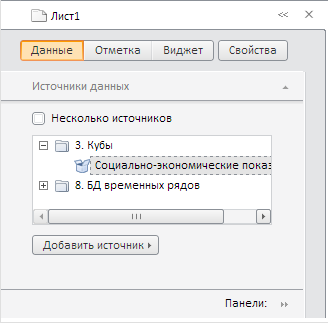

# ExpressView.getSlidePanelViewToolBar

ExpressView.getSlidePanelViewToolBar
-

# ExpressView.getSlidePanelViewToolBar

## Синтаксис

getSlidePanelViewToolBar();

## Описание

Метод getSlidePanelViewToolBar возвращает панель инструментов, предназначенную для смены мастеров в панели свойств экспресс-отчета.

## Пример

Для выполнения примера необходимо наличие на html-странице компонента [ExpressBox](../ExpressBox/ExpressBox.htm) с наименованием «expressBox» (см. [Пример создания компонента ExpressBox](../../../Components/Express/ExpressBox/ExpressBox_Example.htm)). Получим панель инструментов, предназначенную для смены мастеров в панели свойств, и добавим новую кнопку на данную панель:

// Получаем панель инструментов,
// предназначенную для смены мастеров в панели свойств
var toolBar = expressBox.getSlidePanelViewToolBar();
// Создаём новую кнопку
var imgbtn = new PP.Ui.ToolBarButton({
    Parent: toolBar,
    Content: "Свойства",
    ToolTip: "Свойства", // Текст всплывающей подсказки
    IsFlat: false // Объёмная кнопка
});
//Добавляем кнопку на панель инструментов
toolBar.addItem(imgbtn);

В результате выполнения примера на панели инструментов появится кнопка «Свойства»:

См. также:

[ExpressView](ExpressView.htm)

		Справочная
		 система на версию 10.9
		 от 18/08/2025,
		 © ООО «ФОРСАЙТ»,
