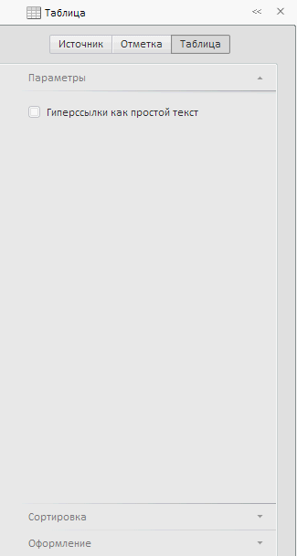

# ExpressView.setSlidePanelViewToolBarMode

ExpressView.setSlidePanelViewToolBarMode
-

**

# ExpressView.setSlidePanelViewToolBarMode

## Синтаксис

setSlidePanelViewToolBarMode(value: PP.Exp.Ui.SlidePanelToolBarMode,
 fireEvent);

## Параметры

*value.* Режим панели
 инструментов.

*fireEvent. Определяет,
 генерировать ли событие смены режима панели инструментов.*

## Описание

Метод setSlidePanelViewToolBarMode**
 устанавливает режим панели инструментов элемента управления, состоящего
 из трех связанных панелей - Header,
 Details и View.

## Пример

Для выполнения примера необходимо наличие на html-странице компонента
 [ExpressBox](../ExpressBox/ExpressBox.htm) с наименованием
 «expressBox» (см. [Пример
 создания компонента ExpressBox](../../../Components/Express/ExpressBox/ExpressBox_Example.htm)) и загруженного в него экспресс-отчета
 (панель инструментов, предназначенная для смены мастеров в панели свойств
 экспресс-отчета, должна быть активной). Переключим мастер в панели свойств
 в положение «Таблица», если активным
 представлением является таблица, или «Формат»,
 если активно любое другое представление:

// Переключаем мастер в панели свойств в положение "Виджет"
expressBox.setSlidePanelViewToolBarMode(PP.Exp.Ui.EaxPropViewMode.Widget, true);

В результате выполнения примера мастер в панели свойств экспресс-отчета
 переключится в положение «Таблица»
 («Формат»):

См. также:

[ExpressView](ExpressView.htm)

		Справочная
		 система на версию 10.9
		 от 18/08/2025,
		 © ООО «ФОРСАЙТ»,
