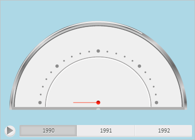

# GaugeBox.refreshView

GaugeBox.refreshView
-

# GaugeBox.refreshView

## Синтаксис

refreshView(args: Object|[PP.Mb.Ui.PropertyChangedEventArgs](dhtmlMetabase.chm::/Classes/Metabase/PropertyChangedEventArgs/PropertyChangedEventArgs.htm));

## Параметры

args. Настройки контейнера
 для спидометра.

## Описание

Метод refreshView обновляет
 контейнер для спидометра в соответствии с указанными настройками.

## Пример

Для выполнения примера необходимо наличие на html-странице компонента
 [GaugeBox](../../../Components/Express/GaugeBox/GaugeBox.htm)
 с наименованием «gaugeBox» (см. «[Пример
 создания компонента GaugeBox](../../../Components/Express/GaugeBox/GaugeBox_Example.htm)»). Перекрасим фон контейнера для спидометра
 в светло-голубой цвет:

if (gaugeBox.isLoaded()) {
    // Обработаем событие Refreshed
    gaugeBox.Refreshed.add(function (sender, args) {
        console.log("Контейнер для спидометра обновлён");
    });
    // Получим настройки контейнера
    var state = gaugeBox.getState();
    var metadata = [];
    for (i in state.getMetadata()) {
        var option = state.getMetadata()[i];
        // Установим для фона контейнера светло-голубой цвет заливки
        if (option.Name == "gaugeMaster.speedometerPanel.fillPanel.color") {
            option.Value = PP.Color.Colors.lightblue;
            metadata.push(option);
        }
    };
    // Определим объект с изменёнными настройками
    var args = new PP.Ui.PropertyChangedEventArgs({
        PropertyName: 'GaugeSettings',
            Metadata: metadata
    });
    // Обновим контейнер для спидометра
    gaugeBox.refreshView(args);
} else {
    console.log("Контейнер для спидометра не загружен.");
};
В результате выполнения примера фон контейнера для спидометра был окрашен
 в светло-голубой цвет:

В консоли браузера было выведено уведомление о том, что контейнер для
 спидометра обновлён.

См. также:

[GaugeBox](GaugeBox.htm)

		Справочная
		 система на версию 10.9
		 от 18/08/2025,
		 © ООО «ФОРСАЙТ»,
