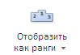
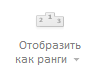

# MainCatView.setEnabledRanking

MainCatView.setEnabledRanking
-

**

# MainCatView.setEnabledRanking

## Синтаксис

setEnabledRanking(value);

## Параметры

*value .*Значение, задающее доступ к кнопке: если равно true, то кнопка «Отобразить как ранги» будет доступна на вкладке, иначе - не доступна.

## Описание

Метод setEnabledRanking** управляет доступом к кнопке «Отобразить как ранги» на вкладке «Главная» ленты инструментов экспресс-отчета.

## Пример

Для выполнения примера необходимо наличие на html-странице компонента [ExpressBox](../ExpressBox/ExpressBox.htm) с наименованием «expressBox» (см. [Пример создания компонента ExpressBox](../../../Components/Express/ExpressBox/ExpressBox_Example.htm)). Откроем доступ к кнопке «Отобразить как ранги» на вкладке «Главная»:

// Получим представление вкладки «Главная»
var category = expressBox.getRibbonView().getMainCategory();
// Откроем доступ к кнопке «Отобразить как ранги»
category.setEnabledRanking(false);

До выполнения примера кнопка «Отобразить как ранги» была активной:

После выполнения примера данная кнопка станет неактивной:

См. также:

		Справочная
		 система на версию 10.9
		 от 18/08/2025,
		 © ООО «ФОРСАЙТ»,
