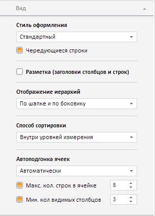

# Конструктор TableViewPanel

Конструктор TableViewPanel
-

**

# Конструктор TableViewPanel

## Синтаксис

PP.Exp.Ui.TableViewPanel(settings);

## Параметры

*settings.* JSON-объект со значениями свойств класса.

## Описание

Конструктор TableViewPanel** создает экземпляр класса **TableViewPanel**.

## Пример

Для выполнения примера необходимо наличие на html-странице компонента [ExpressBox](../ExpressBox/ExpressBox.htm) с наименованием «expressBox» (см. [Пример создания компонента ExpressBox](../../../Components/Express/ExpressBox/ExpressBox_Example.htm)). Далее создадим вкладку «Вид» и добавим ее на панель свойств экспресс-отчета:

// Получаем панель свойств экспресс-отчета
var propBar = expressBox.getPropertyBarView().getControl();
// Создаем вкладку «Вид»
var tableViewPanel = new PP.Exp.Ui.TableViewPanel({
    Source: expressBox.getSource(), // Задаём источник данных
    ViewType: PP.Ui.NavigationItem,
    GroupName: PP.Exp.Ui.PropertyGroups.Table,
    IsRTL: expressBox.getIsRTL()
});
// Добавляем вкладку «Вид» на панель свойств
propBar.addItem(tableViewPanel);

В результате выполнения примера на панели свойств экспресс-отчета будет создана вкладка «Вид»:

См. также:

[TableViewPanel](TableViewPanel.htm)

		Справочная
		 система на версию 10.9
		 от 18/08/2025,
		 © ООО «ФОРСАЙТ»,
