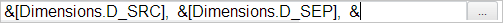

# TitleBox.IsMultiLanguage

TitleBox.IsMultiLanguage
-

# TitleBox.IsMultiLanguage

## Синтаксис

IsMultiLanguage: Boolean;

## Описание

Свойство IsMultiLanguage управляет
 отображением кнопки для перевода заголовка при его редактировании.

## Комментарии

Значение свойства устанавливается из JSON и с помощью метода setIsMultiLanguage,
 а возвращается с помощью метода getIsMultiLanguage.

Если для свойства установлено значение true
 (по умолчанию), то в режиме редактирования заголовка будет отображаться
 кнопка для его перевода, иначе - не будет.

## Пример

Для выполнения примера необходимо наличие на html-странице компонента
 [TitleBox](../../../Components/Express/TitleBox/TitleBox.htm)
 с наименованием «titleBox» (см. «Пример
 создания компонента EaxTitleMaster»). Разрешим редактирование заголовка
 и отображение кнопки для его перевода:

// Получим источник данных заголовка
var source = title.getSource();
// Разрешим для источника данных поддержку нескольких языков
source.setIsMultiLanguage(true);
// Установим заново источник данных
title.setSource(source);
// Разрешим редактирование заголовка
title.setEnableEdit(true);
// Разрешим отображение кнопки перевода заголовка
title.setIsMultiLanguage(true);
После выполнения примера при редактировании заголовка была отображена
 кнопка для его перевода:

При нажатии на кнопку открывается окно «Переводы»:

См. также:

[TitleBox](TitleBox.htm)

		Справочная
		 система на версию 10.9
		 от 18/08/2025,
		 © ООО «ФОРСАЙТ»,
