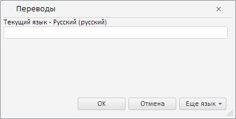

# TitleBox.getTranslateDialog

TitleBox.getTranslateDialog
-

# TitleBox.getTranslateDialog

## Синтаксис

getTranslateDialog();

## Описание

Метод getTranslateDialog возвращает диалог для перевода заголовка.

## Комментарии

Метод возвращает объект типа PP.Mb.Ui.TranslateDialog.

## Пример

Для выполнения примера необходимо наличие на html-странице компонента [TitleBox](../../../Components/Express/TitleBox/TitleBox.htm) с наименованием «titleBox» (см. «Пример создания компонента EaxTitleMaster»). Отобразим окно «Переводы»:

// Получим диалог для перевода заголовка
var dialog = title.getTranslateDialog();
// Отобразим данный диалог
dialog.show();

В результате выполнения примера был отображён диалог для перевода заголовка:

См. также:

[TitleBox](TitleBox.htm)

		Справочная
		 система на версию 10.9
		 от 18/08/2025,
		 © ООО «ФОРСАЙТ»,
