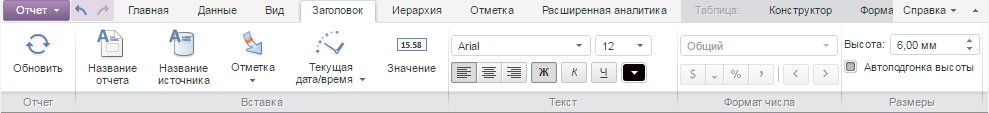

# TitleCatView.getContentRendered

TitleCatView.getContentRendered
-

# TitleCatView.getContentRendered

## Синтаксис

getContentRendered();

## Описание

Метод getContentRendered возвращает
 признак отрисовки элементов вкладки ленты инструментов «Заголовок».

## Комментарии

Метод возвращает значение true,
 если элементы отрисованы, иначе - значение false.

## Пример

Для выполнения примера необходимо наличие на html-странице компонента
 [ExpressBox](../../../Components/Express/ExpressBox/ExpressBox.htm)
 с наименованием «expressBox» (см. «[Пример
 создания компонента ExpressBox](../../../Components/Express/ExpressBox/ExpressBox_Example.htm)»). Для появления вкладки «Заголовок»
 необходимо нажать на кнопку «Заголовок» на вкладке «Главная». Проверяем,
 отрисованны ли элементы из вкладки ленты инструментов «Заголовок», если
 элементы не отрисованы, то отрисовываем их:

// Получаем представление вкладки «Заголовок»
var category = expressBox.getRibbonView().getTitleCategory();
// Проверяем, отрисованы ли элементы
if (category.getContentRendered()) {
    console.log("Элементы вкладки отрисованы");
} else {
    console.log("Элементы вкладки не отрисованы");
    category.renderContent();
}
В результате в консоль будет выведено сообщение о проверки отрисовки
 элементов:

Элементы вкладки не отрисованы

Элементы вкладки «Заголовок» будут отрисованы после вызова метода [TitleCatView.renderContent](TitleCatView.renderContent.htm):

См.
 также:

[TitleCatView](TitleCatView.htm)

		Справочная
		 система на версию 10.9
		 от 18/08/2025,
		 © ООО «ФОРСАЙТ»,
