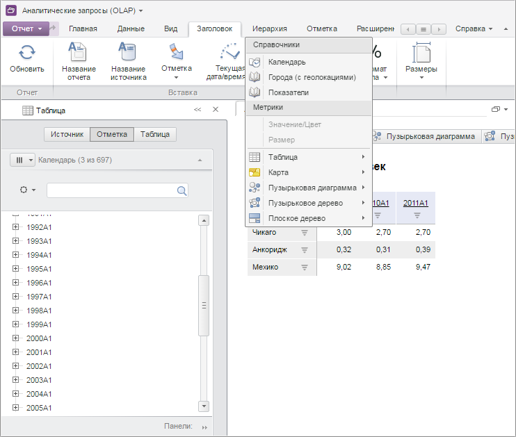

# TitleCatView.getDimSelTitleMenu

TitleCatView.getDimSelTitleMenu
-

# TitleCatView.getDimSelTitleMenu

## Синтаксис

getDimSelTitleMenu();

## Описание

Метод getDimSelTitleMenu возвращает
 меню кнопки «Отметка по измерению» вкладки ленты инструментов «Заголовок».

## Комментарии

Возвращаемое значение - объект класса PP.Ui.[Menu](dhtmlUi.chm::/Classes/Menu/Menu.htm).

## Пример

Для выполнения примера необходимо наличие на html-странице компонента
 [ExpressBox](../../../Components/Express/ExpressBox/ExpressBox.htm)
 с наименованием «expressBox» (см. «[Пример
 создания компонента ExpressBox](../../../Components/Express/ExpressBox/ExpressBox_Example.htm)»). Для появления вкладки «Заголовок»
 необходимо нажать на кнопку «Заголовок» на вкладке «Главная». Отображаем
 меню кнопки «Отметка по измерению» вкладки ленты инструментов «Заголовок»:

// Получаем представление вкладки «Заголовок»
var category = expressBox.getRibbonView().getTitleCategory();
// Отображаем меню
category.getDimSelTitleMenu().showContext(350, 80);
В результате будет отображено меню кнопки «Отметка по измерению»:

См.
 также:

[TitleCatView](TitleCatView.htm)

		Справочная
		 система на версию 10.9
		 от 18/08/2025,
		 © ООО «ФОРСАЙТ»,
