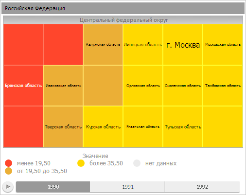

# TreeMapBox.refreshView

TreeMapBox.refreshView
-

# TreeMapBox.refreshView

## Синтаксис

refreshView(args: Object|[PP.Mb.Ui.PropertyChangedEventArgs](dhtmlMetabase.chm::/Classes/Metabase/PropertyChangedEventArgs/PropertyChangedEventArgs.htm));

## Параметры

args. Настройки контейнера
 для плоского дерева.

## Описание

Метод refreshView обновляет
 контейнер для плоского дерева в соответствии с указанными настройками.

## Пример

Для выполнения примера необходимо наличие на html-странице компонента
 [TreeMapBox](../../../Components/Express/TreeMapBox/TreeMapBox.htm)
 с наименованием «treeMapBox» (см. «[Пример
 создания компонента TreeMapBox](../../../Components/Express/TreeMapBox/TreeMapBox_Example.htm)»). Отобразим на легенде 3 интервала
 и расположим её под областью построения плоского дерева слева:

if (treeMapBox.isLoaded()) {
    // Обработаем событие Refreshed
    treeMapBox.Refreshed.add(function (sender, args) {
        console.log("Контейнер для плоского дерева обновлён");
    });
    // Получим настройки контейнера
    var state = treeMapBox.getState();
    var metadata = [];
    for (i in state.getMetadata()) {
        var option = state.getMetadata()[i];
        // Отобразим на легенде плоского дерева 3 интервала
        if (option.Name == "TreeChartMaster.ColorPanel.IntervalsCount") {
            option.Value = 3;
            metadata.push(option);
        }
    };
    // Определим объект с изменёнными настройками
    var args = new PP.Ui.PropertyChangedEventArgs({
        PropertyName: 'TreeChartSettings',
            Metadata: metadata
    });
    // Обновим контейнер для плоского дерева
    var result = treeMapBox.refreshView(args);
    if (!result) {
        // Вызовем событие Refreshed
        treeMapBox.Refreshed.fire(this);
    };
    // Расположим легенду под областью построения плоского дерева слева
    treeMapBox.setLegendPosition("bottom|left");
} else {
    console.log("Контейнер для плоского дерева не загружен.");
};
В результате выполнения примера легенда стала содержать три интервала
 и была отображена под областью построения плоского дерева слева:

В консоли браузера было выведено уведомление о том, что контейнер для
 плоского дерева обновлён.

См. также:

[TreeMapBox](TreeMapBox.htm)

		Справочная
		 система на версию 10.9
		 от 18/08/2025,
		 © ООО «ФОРСАЙТ»,
