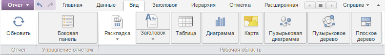

# ViewCatView.getContentRendered

ViewCatView.getContentRendered
-

# ViewCatView.getContentRendered

## Синтаксис

getContentRendered();

## Описание

Метод getContentRendered возвращает
 признак отрисовки элементов вкладки ленты инструментов «Вид».

## Комментарии

Метод возвращает значение true,
 если элементы отрисованы, иначе - значение false.

## Пример

Для выполнения примера необходимо наличие на html-странице компонента
 [ExpressBox](../../../Components/Express/ExpressBox/ExpressBox.htm)
 с наименованием «expressBox» (см. «[Пример
 создания компонента ExpressBox](../../../Components/Express/ExpressBox/ExpressBox_Example.htm)»). Проверяем, отрисованы ли элементы
 из вкладки ленты инструментов «Вид», если элементы не отрисованы, то отрисовываем
 их:

// Получаем представление вкладки «Вид»
var category = expressBox.getRibbonView().getViewCategory();
// Проверяем, отрисованы ли элементы
if (category.getContentRendered()) {
    console.log("Элементы вкладки отрисованы");
} else {
    console.log("Элементы вкладки не отрисованы");
    category.renderContent();
}
В результате в консоль будет выведено сообщение о проверки отрисовки
 элементов:

Элементы вкладки не отрисованы

Элементы вкладки «Вид» будут отрисованы после вызова метода [ViewCatView.renderContent](ViewCatView.renderContent.htm):

См.
 также:

[ViewCatView](ViewCatView.htm)

		Справочная
		 система на версию 10.9
		 от 18/08/2025,
		 © ООО «ФОРСАЙТ»,
