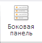
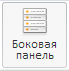

# ViewCatView.setVisiblePropBar

ViewCatView.setVisiblePropBar
-

**

# ViewCatView.setVisiblePropBar

## Синтаксис

setVisiblePropBar(value);

## Параметры

*value.* Значение, управляющее состоянием кнопки «Боковая панель».

## Описание

Метод setVisiblePropBar** управляет состоянием кнопки «Боковая панель» на вкладке ленты инструментов «Вид» - нажимает её и отжимает.

## Комментарии

Если в качестве значения параметра value указано true, то кнопка «Боковая панель» будет нажата, иначе - отжата.

## Пример

Для выполнения примера необходимо наличие на html-странице компонента ExpressBox с наименованием «expressBox» (см. «[Пример создания компонента ExpressBox](../../../Components/Express/ExpressBox/ExpressBox_Example.htm)»). В приведенном ниже примере программно вызывается нажатие кнопка «Боковая панель»:

// Получим представление вкладки «Вид»
var category = expressBox.getRibbonView().getViewRibbonCategory();
// Откроем доступ к кнопке «Условное форматирование»
category.setVisiblePropBar(true);

До выполнения примера кнопка «Боковая панель» была ненажатой:

В результате выполнения примера кнопка «Боковая панель» на вкладке ленты инструментов «Главная» будет нажата:

См. также:

[ViewCatView](ViewCatView.htm)

		Справочная
		 система на версию 10.9
		 от 18/08/2025,
		 © ООО «ФОРСАЙТ»,
