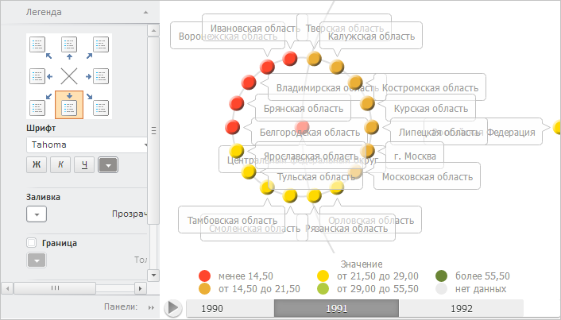

# Пример создания компонента BubbleTreeBox

Пример создания компонента BubbleTreeBox
-

# Пример создания компонента BubbleTreeBox

Для выполнения примера необходимо создать html-страницу и выполнить
 следующие действия:

1. Добавить ссылки на следующие css-файлы: PP.css.

Также нужно добавить ссылки на js-файлы: PP.js, PP.Metabase.js, PP.Express.js,
 PP.TreeChartMaster.js, resources.ru.js.

2. Далее в теге <head> необходимо добавить сценарий, который создает
 контейнер с [пузырьковым деревом](BubbleTreeBox.htm) и [мастер
 для его настройки](dhtmlBubbleTree.chm::/Classes/BubbleTreeMaster/BubbleTreeMaster.htm). При этом предполагается наличие
 в репозитории экспресс-отчёта с ключом 4236:

3. В теге <body> требуется разместить два блока с идентификаторами
 «BubbleTreeBox» и «PropertyBar» для хранения контейнера с пузырьковым
 деревом и мастером для его настройки соответственно:

<body onload="Ready()">
    <table>
        <tr>
            <td>

</td>
            <td>

</td>
         </tr>
    </table>
</body>
После выполнения примера на html-странице были размещены компоненты
 [BubbleTreeBox](BubbleTreeBox.htm) и [BubbleTreeMaster](dhtmlBubbleTree.chm::/Classes/BubbleTreeMaster/BubbleTreeMaster.htm):

См. также:

[BubbleTreeBox](BubbleTreeBox.htm)

		Справочная
		 система на версию 10.9
		 от 18/08/2025,
		 © ООО «ФОРСАЙТ»,
