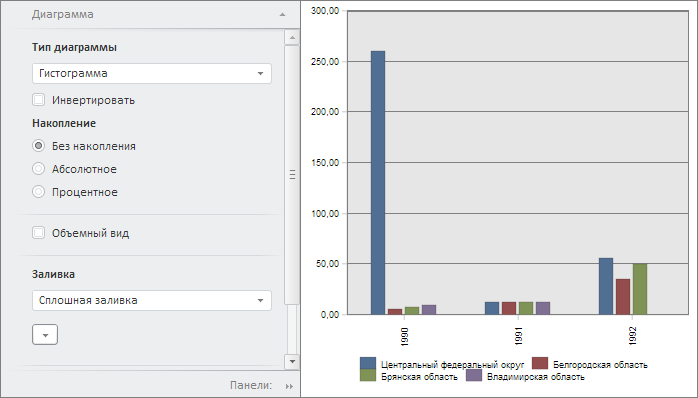

# Пример совместного размещения EaxPropertyBar и ChartBox

Пример совместного размещения EaxPropertyBar и ChartBox
-

# Пример совместного размещения EaxPropertyBar и ChartBox

Для выполнения примера необходимо создать html-страницу и выполнить
 следующие действия:

1. Добавить ссылки на следующие css-файлы: PP.css, PP.Express.css.

Также нужно добавить ссылки на js-файлы: PP.js, PP.Metabase.js, PP.Express.js,
 resources.ru.js.

2. Далее в теге <head> необходимо добавить скрипт, создающий панель
 свойств и диаграмму экспресс-отчёта:

    PP.ImagePath = "../build/img/"; // Путь к папке с изображениями
    PP.ScriptPath = "../build/"; // Путь к папке со сценариями
    PP.CSSPath = "../build/"; // Путь к папке с файлами стилей
    var eaxPropBar, chartBox;
    // Укажем путь к корневой папке, содержащей файлы ресурсов
    PP.resourceManager.setRootResourcesFolder("../resources/");
    // Установим региональные настройки
    PP.setCurrentCulture(PP.Cultures.ru);
    function Ready() {

        var waiter = new PP.Ui.Waiter();
        // Создадим соединение с репозиторием
        metabase = new PP.Mb.Metabase({
            PPServiceUrl: "PPService.axd?action=proxy",
            Id: "WAREHOUSE",
            UserCreds: {
                UserName: "user",
                Password: "password"
            },
            StartRequest: function () {
                // При запросе метаданных отобразим компонент типа PP.Ui.Waiter
                waiter.show();
            },
            EndRequest: function () {
                // После запроса метаданных скроем компонент типа PP.Ui.Waiter
                waiter.hide();
            },
            Error: function (sender, args) {
                // В случае ошибки выведем описание данной ошибки
                alert(args.ResponseText);
            }
        });
        // Откроем соединение с репозиторием
        metabase.open();
        // Создадим сервис для работы с экспресс-отчётами
        eaxMdService = new PP.Exp.EaxMdService({
            Metabase: metabase
        });
        // Откроем экспресс-отчет с ключом 4369 на редактирование
        eaxAnalyzer = eaxMdService.openDocument(4369);
        // Создадим диаграмму
        chartBox = new PP.Exp.Ui.ChartBox({

            Source: eaxAnalyzer, // Источник данных
            ParentNode: "chartBox",
            Service: eaxMdService, // Сервис
            EditMode: PP.Exp.Ui.ChartEditMode.Point, // Редактирование по точкам
            Width: 400,
            Height: 400,
            SelectionEnabled: true, // Выделение доступно
            ShowLoadConfirm: true, // Выведем сообщение при превышении максимального числа точек диаграммы
            LoadConfirmThreshold: 1000 // Максимальное число точек диаграммы
        });
        // Создадим панель свойств экспресс-отчета
        eaxPropBar = new PP.Exp.Ui.EaxPropertyBar({
            ParentNode: "propertyBar",
            Source: eaxAnalyzer, // Источник данных
            Width: 300,
            Height: 400,
            Service: eaxMdService,
            DimViewMode: PP.Exp.Ui.DimViewMode.Classic,
            DataView: chartBox // Панель свойств привяжем к диаграмме
        });
        // Отобразим мастер для настройки диаграммы
        eaxPropBar.showChartMaster(PP.Exp.Ui.PropertyGroups.Chart)
    };
3. В теге <body> в качестве значения атрибута «onLoad» указываем
 название функции для создания боковой панели и диаграммы экспресс-отчета,
 а также размещаем блоки с идентификаторами «propertyBar» и «chartBox»:

<body onload="Ready()">
    <!-- Боковая панель -->
    

    <!-- Диаграмма -->
    

</body>
После выполнения примера на html-странице будут размещены компоненты
 [PP.Exp.Ui.EaxPropertyBar](../EaxPropertyBar/EaxPropertyBar.htm)
 и [ChartBox](ChartBox.htm):

См. также:

[ChartBox](ChartBox.htm)

		Справочная
		 система на версию 10.9
		 от 18/08/2025,
		 © ООО «ФОРСАЙТ»,
