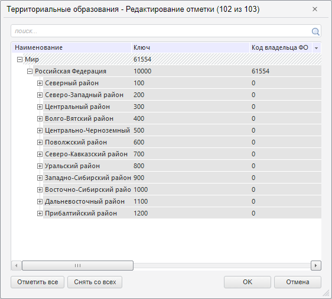

# Пример создания компонента DimSelectionDialog

Пример создания компонента DimSelectionDialog
-

# Пример создания компонента DimSelectionDialog

Для выполнения примера необходимо наличие экспресс-отчёта с ключом 65760,
 в котором находится измерение с ключом 10152. Для получения ключей измерений
 используйте метод [EaxAnalyzer.getDims](../../../Classes/Express/EaxAnalyzer/EaxAnalyzer.getDims.htm).
 Создайте html-страницу и выполните следующие действия:

1. В теге <head> добавьте ссылки на js и css-файлы:

	- PP.js;

	- PP.Metabase.js;

	- PP.App.js;

	- PP.Express.js;

	- resources.ru.js;

	- PP.css;

	- PP.App.css;

	- PP.Express.css;

	- PP.Metabase.css.

2. Дополнительно задайте стиль для элементов:

3. Добавьте скрипт, который создает компонент для отображения и изменения
 текущей отметки:

4. В теге <body> в качестве значения атрибута «onLoad» укажите
 имя функции для загрузки экспресс-отчёта. Внутри тега разместите кнопку,
 при нажатии на которую будет создан компонент для изменения отметки:

<body onselectstart="return false" class="PPNoSelect" onload="Ready()">
    <input type="button" value="Создать диалог" onclick="openDialog()" />
</body>
5. После тега </html> вставьте код, устанавливающий стили к вершине
 «document.body», соответствующие операционной системе клиента:

В результате выполнения примера, после нажатия на кнопку «Создать
 диалог» на html-странице, будет размещен компонент [DimSelectionDialog](DimSelectionDialog.htm):

См. также:

[DimSelectionDialog](DimSelectionDialog.htm)

		Справочная
		 система на версию 10.9
		 от 18/08/2025,
		 © ООО «ФОРСАЙТ»,
